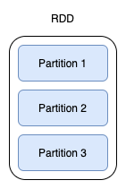
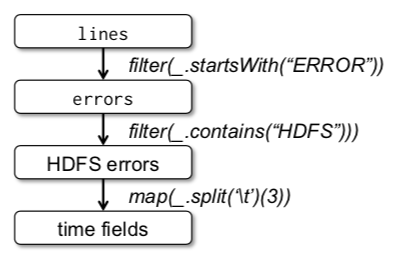

# L15: Big Data: Spark
# 1. Introduction

- MapReduce 같은게 있기는 했지만 distributed memory를 잘 이용하게 하는데는 역부족이었다. 그래서 여러 computations에 걸쳐 중간 결과를 재활용하는 어플리케이션에 쓰기에는 부적절했다. 예를 들면 머신 러닝, 데이터 마이닝 이런 거 말이다...


하둡이는 슬퍼요..

- 이 논문에서는 새로운 abstraction을 제안한다. 바로 RDD(resilient distributed datasets)이다.
- RDD는 효율적으로 data를 재활용할 수 있게해준다. 뒤에서도 설명해주겠지만 fault-tolerant 하고 유저가 explicitly 하게 중간 결과를 메모리에 유지할 수 있도록 해주는 parallel 자료 구조라고 한다.

# 2. Resilient Distributed Datasets (RDDs)

## 2.1 RDD Abstraction

- RDD는 read-only이고 레코드들의 파티션된 컬렉션이다. 즉, 데이터들을 묶기는 하지만 나눠서 저장하는 것 같다.



- 스토리지 혹은 다른 RDD에 deterministic 연산을 통해서만 만들어질 수 있다.
- 유저는 RDD의 persistence와 partitioning을 컨트롤할 수 있다. 어떤 RDD를 재이용할 것이고 스토리지 전략은 어떻게 할 것인지 정할 수 있다. 그리고 레코드의 키를 바탕으로 여러 머신에 엘리먼트가 파티셔닝되도록 할 수 있다.

## 2.2 Spark Programming Interface

- RDD를 action에 이용할 수 있다. action이라고 하면 count, collect, save 이런 것들이 있다.
- 스파크는 RDD 연산을 lazy 하게 수행한다. 즉, transformation을 바로바로 하는 게 아니라 action이 일어날 때 파이프라이닝을 한다. (장고만 그런 건지는 모르겠는데 장고도 디비에서 데이터 가져올 때 이렇게 하더라구요..)
- 그리고 유저는 위에서 언급했던 것처럼 RDD를 재이용하기 위해 메모리에 persistent하게 해놓을 수 있다. RAM이 부족하면 디스크에 나눠놓을 수도 있다.
- 예시를 봐보자!
    - 웹 서비스에 에러가 나서 HDFS에서 terabytes의 로그를 뒤적거린다고 해보자.
    - 이럴 때 다음과 같은 스칼라 코드를 짤 수 있다.

        ```scala
        lines = spark.textFile("hdfs://...")
        errors = lines.filter(_.startsWith("ERROR"))
        errors.persist()
        ```

    - 위까지 코드를 실행했을 때, 실제로 작업이 이루어지지 않는다.
    - 만약 action인 `count()` 를 호출하면 그때 작업을 시작한다.

        ```scala
        errors.count()
        ```

    - 스파크는 `errors` 의 파티션들을 메모리에 저장할 것이기 때문에 뒤이은 연산들을 빠르게 처리할 수 있다. 단, 이때 base RDD인 `lines` 는 메모리에 올라가지 않는다. 만약, `errors` 파티션을 잃어버리면 `lines`를 이용해 다시 만들어낸다.

## 2.3 Advantages of the RDD Model

- RDD는 distributed shared memory (DSM)과 비교할 수 있다. RDD는 큰 단위의 transformation을 통해서 만들어지지만, DSM은 각각의 메모리 공간에서 읽고 쓴다.
- RDD는 lineage를 사용해 회복될 수 있기 때문에 체크 포인트에 대한 오버 헤드가 없다. 그리고 전체가 아닌 RDD의 잃어버린 파티션만 다시 계산하면 된다.

    

- 그리고 RDD는 불변성이라는 특성을 가지기 때문에 DSM에서는 구현하기 어려운 동시 접근 문제도 없다.
- RDD는 bulk 연산이 가능하고 데이터 locality에 기반해 런타임에 태스크를 스케줄 할 수 있다는 장점이 있다. 메모리가 충분히 없다면 무리해서 올리는 게 아니라 적정량만 올리고 나머지는 disk에 저장한다는 장점도 있다.

## 2.4 Applications Not Suitable for RDDs

- RDD는 배치 어플리케이션에 적절하다.
- 공유된 상태에 대해 작은 단위의 업데이트를 비동기적으로 하는 어플리케이션에는 적절하지 않다.
    - 웹 어플리케이션을 위한 스토리지
    - 웹 크롤러

# 3. Spark Programming Interface

- Spark는 language-integrated API를 통해 RDD abstraction을 제공한다.
- 개발자는 워커들과 연결하는 driver program을 작성한다. driver에서는 1개 이상의 RDD를 작성하고 action을 호출한다. 이때 RDD의 lineage 역시 트랙킹한다.
- 워커는 RAM에 RDD 파티션들을 저장할 수 있는 long-lived 프로세스이다.


(RDD 연산, 예시 applications는 생략)

# 4. Representing RDDs

- RDD abstraction에서 챌린지 중 하나는 여러 트랜스포메이션에 걸쳐있는 lineage를 트랙킹할 수 있는 표현법을 찾는 것이다. 이걸 위해 simple graph-based 표현법을 제안한다.
- 각각의 RDD는 다음과 같은 다섯 가지 정보를 갖는다.
    1. a set of partitions
    2. a set of dependencies on parent RDDs
    3. a function for computing the dataset 
    4. 5. metadata about its partitioning scheme and data placement
- 여기서 가장 중요한 건 RDD간의 dependency를 어떻게 표현하는가이다.
- 이때 dependency를 두 가지로 분류하는 게 충분하고 유용하다.
    1. narrow: 부모 RDD가 최대 자식 RDD의 하나의 파티션에서 사용된다.
    2. wide: 여러 개의 자식 파티션들이 부모에 의존한다.

    

### pipelined execution

- 먼저 narrow dependency는 하나의 클러스터 노드에서 pipelined execution을 가능하게 한다. 모든 부모 파티션들에 대해서 계산할 수 있다. 예를 들면, 맵을 한 다음에 필터를 할 때 엘리멘트 베이스로 할 수 있다. 반면 wide dependency는 모든 부모 파티션들에 있는 데이터가 가능해야하고 노드들에 걸쳐 셔플돼야 한다.

    

    - pipelining?
        - [https://binaryterms.com/wp-content/uploads/2019/09/Pipelining-Instructions.jpg](https://binaryterms.com/wp-content/uploads/2019/09/Pipelining-Instructions.jpg)

        

    - shuffle?
        - [https://sparkbyexamples.com/spark/spark-shuffle-partitions/](https://sparkbyexamples.com/spark/spark-shuffle-partitions/)

        > Shuffling is a mechanism Spark uses to redistribute the data across different executors and even across machines. Spark shuffling triggers for transformation operations like groupByKey(), reducebyKey(), join(), union(), groupBy()

        - 예를 들면, `reducebyKey` 에서는 특정 key를 가진 데이터를 모두 모아야한다. 이때, 이 데이터가 여러 곳에 흩어져있기 때문에 데이터의 위치를 재조정하는 것이다.

### recovery

- 그 다음으로는 노드 실패 이후 recovery가 narrow dependency가 더 효율적이다. 딱 잃어버린 부모 파티션만 다시 계산하면 되기 때문이다. 그리고 이건 여러 노드에서 parallel 하게 할 수 있다. 반면, wide dependency는 노드 하나의 실패가 몇몇 파티션의 손실로 이어질 수 있다. 즉, 완전히 계산을 다시해야할 수 있다.


# 5. Implementation

## 5.1 Job Scheduling

- 유저가 RDD에 action을 수행할 때마다 스케줄러는 실행할 stage들의 DAG를 빌드하기위해 RDD의 lineage graph를 검사한다.
- 각각의 stage는 가능한 많은 narrow dependency를 가지는 pipelined transformations을 포함한다.
- stage들의 바운더리는 wide dependency를 필요로하는 shuffle operations이다. 혹은 미리 계산된 파티션이 있어도 바운더리가 될 수 있다.
- 아래는 stage가 어떻게 되는지를 보여준다. 검은색은 파티션이 이미 메모리에 있는 상태를 나타낸다. stage1의 아웃풋 RDD는 이미 메모리에 있어서 stage2와 3만 실행한다.


- 스케줄러는 데이터 로컬리티에 기반해 태스크들을 노드들에 할당한다. 태스크가 필요로 하는 파티션이 이미 메모리에 있다면 해당 태스크는 그 노드로 보낸다. 다른 경우라면 HDFS 같은 곳에서 가져와야 하는데 그에 맞는 노드로 태스크를 보낸다.
- 만약 테스크가 실패한다면, stage의 부모들이 아직 이용가능하다면 또 다른 노드에서 다시 수행한다. 만약 몇몇 스테이지들이 불가능해지면, 잃어버린 파티션을 parallel하게 계산하기위해 태스크들을 다시 제출한다.

## 5.2 Interpreter Integration

- 스칼라 인터프리터를 변형했다.

그~~렇게 안 중요해보이니 스킵...~~

## 5.3 Memory Management

- serialization?

    

    [https://image.slidesharecdn.com/deserializemyshorts-160321174335/95/owasp-sd-deserialize-my-shorts-or-how-i-learned-to-start-worrying-and-hate-java-object-deserialization-11-638.jpg?cb=1458593776](https://image.slidesharecdn.com/deserializemyshorts-160321174335/95/owasp-sd-deserialize-my-shorts-or-how-i-learned-to-start-worrying-and-hate-java-object-deserialization-11-638.jpg?cb=1458593776)

    - 스토리지에 저장하거나 네트워크에 태우기 위해 자바 상에서 표현되는 객체를 바이트로 표현하는 것
    - deserialization은 그 반대
- 스파크는 persistent RDD의 스토리지로 세 가지 옵션이 있다.
    1. in-memory storage as deserialized Java objects
        - 퍼포먼스가 가장 좋다.
        - 왜냐하면 Java VM이 각각의 RDD 엘리먼트에 네이티브하게 접근할 수 있기 때문이다. 즉, 별도의 변환 과정이 필요없다.
    2. in-memory storage as serialized data
        - 공간이 제한적일 때 좀 더 메모리 효율적인 표현을 가능하게 해준다.
        - 대신 퍼포먼스가 위보다 낮아진다.
    3. on-disk storage
        - RDD를 RAM에 유지하기가 너무 크지만 매번 계산하기에는 코스트가 클 때 유용하다.
- 제한된 메모리 사용량을 관리하기 위해 RDD 수준에서 LRU eviction policy를 사용한다. 새로운 RDD 파티션이 계산됐는데 충분한 공간이 없다면 가장 오랫동안 사용하지 않은 RDD의 파티션을 쫓아낸다. 단, 새로운 파티션과 같은 RDD가 아니여야한다. 이렇게 하는 이유는 같은 RDD에서 사이클하게 나갔다 들어왔다하는 걸 막기 위해서이다
- 현재는 클러스터내의 각각의 스파크 인스턴스는 자신만의 메모리 공간을 가진다.

## 5.4 Support for Checkpointing

- RDD recover에 lineage를 쓸 수 있지만 시간이 오래 걸릴 수 있기 때문에 stable storage에 RDD에 대한 체크포인트를 만들어두는 게 도움이 될 수 있다.
- 보통 wide dependency를 가지는 긴 lineage graphs에서 유용하다. 체크포인트를 쓸 지는 유저한테 맡긴다. (물론 이걸 자동화하는 것도 조사하는 중이었다고 해서 지금쯤은 될지도...?)
- RDD의 읽기 전용이라는 특성은 일반적인 공유 메모리보다 더 체크 포인트를 쓰기 쉽게 만들었다. consistency는 신경쓰지 않아도되기 때문에 RDD들은 프로그램이 멈추거나 스냅샷없이도 백그라운드로 쓰여질 수 있다.

# 6. Evaluation

- Running times for iterations


- fault recovery
    - 6번째 이터레이션의 시작에서 머신 하나를 kill 했다.
    - 6번째 이터레이션에만 지장이 있었고 다시 정상적으로 돌아왔다.


# 9. Conclusion

- RDD
    - efficient
    - general-purpose
    - fault-tolerant
    - sharing data in cluster applications
- RDD는 lineage를 사용해 효율적으로 데이터를 recover하는 coarse-grained(큰 단위의) transformations을 기반으로 하는 API를 제공한다.
