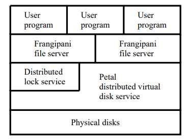
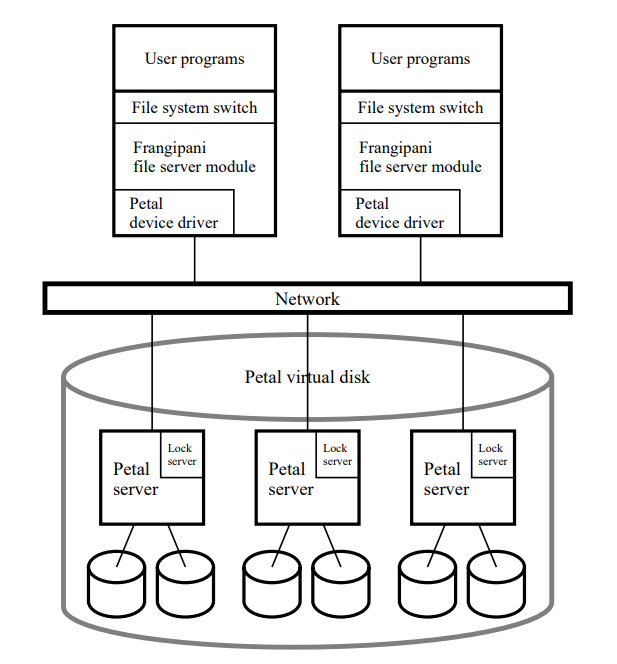
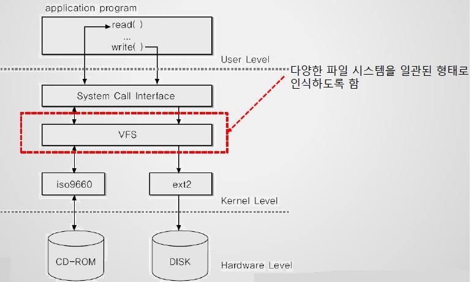
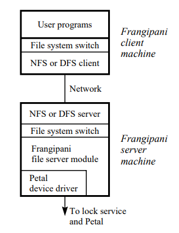
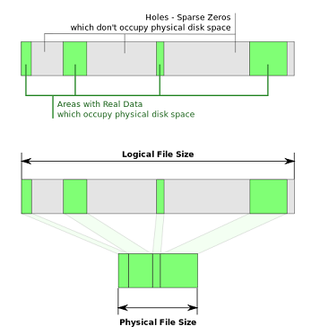
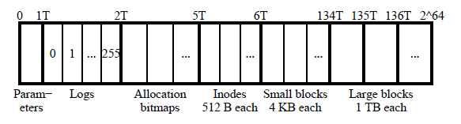

## 시작하기 앞서!

Cache coherency로 소개된 frangipani는 **distributed file system**입니다.

해당 논문에서는 우리가 고민하는 내용인 분산 환경에서의 확장성, 고가용성, 일관성 등을 어떻게 보장하는지도 다루지만,

cache coherency를 설명하려다보니 storage-specific한 내용들도 많이 다루고 있습니다. 😈

(물론 쓸데없는 내용도 많습니다)

이쪽에 너무 치중하지 마시고 전체적으로 어떻게 분산 환경의 컨셉을 확보하는지, cache coherency는 어떻게 확보하는지 등을 보시면 될 것 같습니다.

개인적으로는 밑단 모듈의 특성을 가지고 신기한 분산 시스템을 만들었다는 생각을 했습니다.

그리고 논문에 그림이 없고 글만 빽빽해서 내용이 꽤 많습니다만 **~~30분 안짝에 해보겠습니다~~** 😈😈

## Abstract

이상적인 분산 파일시스템이라면?

- 공유 파일에 대한 **일관성(coherence)** 보장
- **확장가능성(scalable)**
- **고가용성(high-available)**

→ **Frangipani** 💥

**Two-layer structure**

- **Petal** 💥
    - Scalable, HA **virtual disk**를 제공하는 분산 스토리지
- **Frangipani** + **lock service** 💥

## 1. Introduction

점점 커지는 파일시스템을 운영하는것은 너무 많은 수작업을 필요로 함

- 디스크가 부족하면? → 추가해서 노드에 붙이고..
- 노드가 부족하면? → 노드를 사서 scale out 하고..
- 디스크를 논리적으로 묶어주는 **RAID도 결국 디스크가 너무 많아지면 관리가 힘들어짐**
    - [https://raisonde.tistory.com/entry/RAID0부터-RAID7까지-모든-RAID구성을-알아보자](https://raisonde.tistory.com/entry/RAID0%EB%B6%80%ED%84%B0-RAID7%EA%B9%8C%EC%A7%80-%EB%AA%A8%EB%93%A0-RAID%EA%B5%AC%EC%84%B1%EC%9D%84-%EC%95%8C%EC%95%84%EB%B3%B4%EC%9E%90)

**Frangipani**는 여러 노드에 분산된 디스크들을 **하나의 shared pool**처럼 보이게 하는 + **확장이 용이**한 분산 파일시스템

매우 **간단한 내부 구조**가 장점

- 다수의 **Frangipani file server**는 **Petal**이라는 common store에 접근
- 접근은 **lock service**를 통해 관리됨

또한 다음과 같은 **key aspect**들이 있음

- 모든 유저들은 동일한 파일 set에 대해 일관된 뷰를 가짐
- 새 서버의 추가는 **기존 서버의 재설정 및 downtime없이 쉽게 진행됨**
- 관리자는 유저를 추가할때 어떤 노드 혹은 어떤 디스크에 할당할지 고민할 필요가 없음
- 관리자는 전체 파일시스템에 대한 full backup을 진행할 수 있고, 옵션에 따라 유저는 backup에 온라인을 통해 접속할 수 있음
- 관리자의 개입없이 노드, 네트워크, 디스크 에러 상황에 견디고, 복구할 수 있음

Petal은 physical disk를 묶어서 **shared virtual disk**를 제공

- physical disk와 같이 **block 단위로 구성**
- physical disk와 다르게 (논리적으로) **a sparse 2^64 byte address space**를 제공

Frangipani는 Petal의 장점을 **file system level까지 확장**하기 위해 설계됨

## 2. System Structure

**해당 이미지 따로 캡쳐떠서 보여주면서 같이 설명하기!**

- User program과 Frangipani가 같은 노드에 동작하지 않아도 되며,
- Petal서버에 큰 load가 걸리지 않는 상황이라면 Frangipani와 petal을 굳이 분리 안해도됨
- lock service의 경우 Petal 서버가 아니라 외부 서버에 있어도 됨

### 2.1 components

User program은 standard OS call을 통해 Frangipani file system에 접근 가능 (NFS 처럼 mount 해서)

**File system switch** 란 다양한 Device ( Disk or CD-ROM 등 )의 데이터들을 file system화 하여 볼 수 있게 하는 기법 ( =  VFS, virtual file system )

[https://kdata.or.kr/info/info_04_view.html?field=&keyword=&type=techreport&page=134&dbnum=128495&mode=detail&type=techreport](https://kdata.or.kr/info/info_04_view.html?field=&keyword=&type=techreport&page=134&dbnum=128495&mode=detail&type=techreport)

일반 Unix file system이 제공하는 것과 동일한 semantic을 제공받음

- file change는 일단 **local kernel buffer pool(메모리, cache)에 staging 상태**로 있고, sync 혹은 fsync와 같은 system call이 있기 전까지 **non-volatile disk에 적용되지 않음**
- 다만 **metadata log( file자체의 수정기록 )는 선택적으로 disk에 남길 수 있음**
    - [https://systemdesigner.tistory.com/87](https://systemdesigner.tistory.com/87)

**Frangipani file server module**은 OS kernel 안에서 동작

자기 자신을 VFS(virtual file system switch)에 **하나의 file system 형식으로 등록**

Petal device driver를 통해 Petal virtual disk에 접근

각각의 file server module은 **Petal virtual disk 안에 redo log를 가지고 있음**

- 만약 server가 깨지면, 다른 서버가 붙어서 disk에 있는 **redo log를 읽고 복구할 수 있음.**
- 그렇기에 **frangipani 서버간 통신은 전혀 필요없음**
    - frangipani <-> petal
    - frangipani <-> lock service

→ Scale in/out, 복구작업을 하는게 굉장히 간단해짐. 그냥 frangipani 서버 추가하고 lock, petal에 연결하면 끝

Petal server은 자체로 확장성 및 fault-tolerance 시스템을 갖춤.

- 과반수 이상의 서버가 살아있고,
- 각 data block마다 1개 이상의 copy가 연결 가능하면 서버 및 디스크 에러에 문제 없음

lock service는  multiple read / single write lock을 제공 + 분산 환경에서 잘 동작하도록 설계됨

frangipani는 이 lock service를 사용하여 petal virtual disk에 대한 access를 조절함.

### 2.2 Security and the Client/Server Configuration

frangipani는 대체로 모든 컴포넌트들이 **신뢰할 수 있는 환경에서 동작하는 것을 가정**함.

*(그래서 Figure2가 저렇게 생김)*

Figure2를 보면, user program을 호스팅하는 머신은 frangipani filer server module도 호스팅함

→ 이렇게 하면 속도 측면에서 이점이 있겠지만, **보안에서 잠재적 위험을 가짐**

1. frangipani server는 **Petal virtual disk의 모든 block을 읽을 수 있음**

- User가 **임의로** frangipani module을 포함한 modified OS로 부팅을 한다면?

    → User는 Petal virtual disk의 모든 block을 읽을 수 있음

2. User는 frangipani - petal 통신 네트워크에 접근할 수 있음

- User가 임의로 해당 네트워크 패킷을 가로챈다면?

    → 냅둬선 안됨..

—> 신뢰할 수 없는 환경에서의 Full Security를 위해선, **모든 컴포넌트들 사이의 보안이 각각 확보되어야 함**

- frangipani client(User)와 server를 분리
- frangipani - petal 사이의 망을 private network 혹은 SW적인 방법으로 분리

→ untrusted user는 frangipani server를 거치지 않고 petal server에 직접 접근할 수 없음

frangipani는 NFS, DCE/DFS를 통해 연결이 가능함

***(The DCE Distributed File System (DCE/DFS) is the remote file access protocol used with the Distributed Computing Environment.)***

NFS가 아니라 **DCE/DFS를 사용하는 것**이 좋은데, 해당 프로토콜이 frangipani의 일관성 유지 및 multiple server 환경에서 failover 등을 지원하기 때문

해당 아키텍처가 권장되는 또 다른 이유는 frangipani는 커널에서 동작하기 때문에 **OS의 종류 및 버전에 굉장히 민감**한데, **unsupported OS에서 동작하는 user program이 frangipani에 접근할 수 있게 됨**

## 3. Disk Layout

**2^64 byte 라는 아주 굉장히 거대한 sparse disk 공간을 가짐.**  (18.4467441 엑사바이트...)

***Sparse file은 생성될 때 전체 크기를 할당하지 않고 실제 데이터가 존재하는 영역만 생성하며, 쓰기가 있을 때만 블럭이 할당되어 디스크 공간을 효율적으로 사용하는 기법***

Petal virtual disk는 64KB 단위로 physical disk에 commit을 하는데, 이는 꽤 큰 fragmentation을 유발할 수 있지만 구조의 편의성을 위해 이와 같이 설정함

첫번째 공간(1TB)은 

- 각종 config들을 보관하는 영역

두번째 공간(1TB)은 

- frangipani server들의 redo log를 보관하는 영역
- 256개로 쪼개져있음 → 최대 256개의 frangipani server가 존재할 수 있음 ( 이는 수정 가능 )

세번째 공간(3TB)은

- Allocation bitmap으로, 남은 공간의 어떤 block이 비어있는지를 기록
- frangipani server들은 bitmap을 통해 실질적인 공간을 점유(lock)

네번째 공간(1TB)은

- 각 file들의 metadata(timestamp, pointer)를 기록하는 inode 공간
- 각 inode는 512byte로 설정하여 false sharing 방지
    - [https://software.intel.com/content/www/us/en/develop/articles/avoiding-and-identifying-false-sharing-among-threads.html](https://software.intel.com/content/www/us/en/develop/articles/avoiding-and-identifying-false-sharing-among-threads.html)
- 최대 2^31개의 inode 생성 가능 → 2^31개의 파일 생성 가능

다섯번째 공간(128TB)은

- 작은 data block들 (4KB)로 구성
- 모든 파일은 이 공간에 먼저 쓰이고 64KB보다 커질 경우, 뒷부분은 여섯번째 공간에 쓰임

여섯번째 공간(??TB)은

- 큰 data block (1TB)으로 구성
- 파일의 최대 크기는 1TB + 64KB로 제한 (수정 가능)

해당 구성은 fragmentation에 취약할 수 있지만, simplicity를 더 중시했고, 경험상 괜찮아서 채택

## 4. Logging and Recovery

각 frangipani server들은 petal disk에 **자신만의 redo log(metadata)를 기록**

frangipani server는 자신의 메모리(cache)에 있는 redo log에 **새로운 record를 붙임**

→ **이 record들이 순차적, 주기적으로 disk에 기록됨 (약 30초)**

동시에 기록되게 할 수 있는데, failover는 더 잘되지만 너무많은 metadata operation이 발생

각 log record는 128KB로 사이즈 제한 (2개 64KB block이 HA를 위해 Petal에 저장됨)

각 frangipani server의 redo log를 위해 할당된 공간은 **circular buffer 처럼 동작**

→ 꽉 차면 오래된 25%의 로그 공간을 새 로그를 위해 확보

→ 만약 오래된 내용이 아직 petal disk에 쓰이지 않은 내용이라면, **확보 전에 다 쓰고 확보함**

frangipani server가 깨지면, 해당 server의 redo log로 **파일의 복구**진행 (서버 자체는 복구 필요X)

Recovery daemon은 **failed server의 log와 lock에 대한 권한을 다른 서버에 위임**

그 다음 log record의 update를 순서대로 전부 완료한 뒤, lock을 풀고 failed server의 log는 전부 날림

(failed server가 갖고있던 metadata는 전부 disk에 반영 완료되었으므로)

frangipani는 아래와 같은 장점을 통해 **recovery의 무결함을 보장**함

- **lock**은 같은 파일에 대한 여러 서버의 업데이트 상황에서 동기화를 해줌
- redo log를 **record별로 관리/실행**하기 때문에, 이미 실행된 record는 다시 실행하지 않음
- failed server의 모든 log와 lock에 대한 권한은 **recovery daemon에게 귀속되어, recovery가 끝나기 전까지 풀리지 않음**

## 5. Synchronization and Cache Coherence

shared access file system에서 동기화는 필수!

frangipani는 **multiple-read / single-write lock**을 활용하여 동기화를 진행

만약 lock이 충돌하는 상황이 오면, lock 보유서버는 아래의 두가지 선택지를 가짐

- **release**
- **downgrade(write → read)**

**read lock**은 disk(Petal)에서 data를 읽어와서 캐싱할 수 있게함

- 만약 read lock을 뺏기면 서버는 **해당 캐시를 invalidate 해야함**

(A가 lock을 가지고 캐싱한 상태에서 lock을 반환하는데, 캐시를 그대로 둔다면, B가 lock을 가지고 동일한 파일을 수정한 뒤라도 해도 A는 캐시에서 그대로 확인하게 되므로 **coherence가 깨짐**)

**write lock**은 server가 특정 data에 대해 read/write 할 권리를 줌

→ 서버의 cached copy은 오직 write lock이 있을때만 disk의 data와 달라질 수 있다

서버가 write lock을 release할지 read lock으로 강등할지 요구 받으면, **dirty data를 전부 disk에 쓰고 lock을 반환해야 한다**

cached data에 대해서는 disk에 반영을 했기때문에 read는 가능. 하지만 **release lock을 했다면 read도 못하게 cache를 invalidate 해야한다**

→ **Data access에 대한 동기화**도 중요하지만 File system 구조상 **cache를 동기화하는 작업**도 중요

## 6. The Lock Service

lock은 **multiple-read /single-write lock**을 제공

frangipani server는 다른 서버가 요구할때까지 lock을 계속 가지고 있음 **(sticky lock)**

lock service는 frangipani server failure에 대비하기 위해 **lease를 활용.**

lock과 함께 lease를 주고, 매 30초마다 이를 갱신하게 함. 

→ 갱신하지 않으면 **server failure가 발생한 것으로 간주**

network 문제가 발생할 경우, frangipani server가 깨진게 아니지만 lease 갱신을 못하게 되고, petal과의 통신이 끊김

→ 이를 server 자체도 인식하고 **모든 lock과 cache안에 있는 데이터를 버림**

(일부 내용은 이미 disk에 들어가서 recovery를 시작했을 것임. network 복구 이후엔 그냥 복구된 부분부터 다시 시작하는 것이 정합성을 깨뜨리지 않음)

→ 그리고 **user의 모든 요청에 대해 error를 리턴함**

다소 극단적인 정책일 수 있지만 **간결함을 위해서 이 방식을 채택**

lock service는 **lock들을 table이라는 단위**로 묶어서 관리

frangipani server는 file system을 마운트할때 file system module에 있는 **lock clerk**와 연결하면, **clerk는 lock server로부터 server lock table을 받아서 제공**

lock clerk는 lock server로부터 lock state table을 가져와서 frangipani server한테 보여줌

- request, release ( clerk → server )
- grant, revoke ( server → clerk )

lock service는 Paxos 알고리즘을 통해 동작하며 global lock status를 관리 (Petal도 Paxos)

global status에는 lock server들, 모든 lock들의 정보 및 현재 file server와 연결된 lock clerk들의 정보가 기록됨

lock service는 lock server간 heartbeat를 통해 failure를 발견

다수가 살아있으면 fault tolerance

lock server들도 각각 lock들을 나눠서 관리하는데, lock server의 failure로 lock들을 재할당하는 경우가 있음

이때 재할당은 lock들이 lock server에 고르게 분포되는지, lock이 하나의 lock server에만 할당되는지 등을 고려하여 재할당됨

이는 두단계로 진행되는데, 

- lock을 잃는 lock server가 lock을 모두 반환
- lock을 받는 lock server는 받은 lock의 상태를 clerk를 통해 알아내고, clerk에게 lock의 관리자가 바뀜을 알려줌

만약 frangipani server가 깨지면, lock server는 lock을 모두 회수하고 다른 frangipani server의 clerk에게 해당 lock을 넘기고 recovery를 요구

만약, network partition 상황에서 petal이랑은 통신이 되는데 lock service랑만 통신이 안된다면, lease갱신이 안되는데, lease갱신이 안되는 상황만 가지고 frangipani server는 error state로 전환하지 않음. → 이때 write을 요청한다면 potential 문제가 있음 (petal은 lock service를 믿고 체크안함)

→ 이를 방지하기 위해 petal에서도 lock expiration stamp를 따로 체크하게 할 예정

## 7. Adding and Removing Servers

frangipani는 scale in/out이 굉장히 쉽게 설계됨

서버를 추가하려면, petal server와 lock service 주소만 알려주고 frangipani를 세팅하면 됨

그 외 lock lease 취득, redo log 공간 확보 등은 전부 알아서 되므로 관리자의 개입 필요 없음

서버 삭제는 그냥 끄면됨...

dirty data(cache data)를 disk로 flushing하고 lock을 다 풀고 하면 좋지만 굳이 안해도 recovery system이 알아서 복구를 함

Petal server와 lock server도 마찬가지로 쉽게 확장 및 축소가 가능 (Paxos)

## 8. Backup

Petal의 snapshot 기능을 활용.

- full / partial

Petal의 snapshot을 통해 frangipani file system을 전체 복구하는 것이 가능

## Performance & Related work

~~SKIP...~~