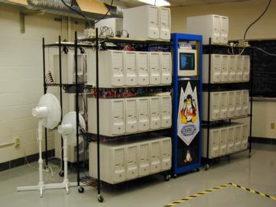
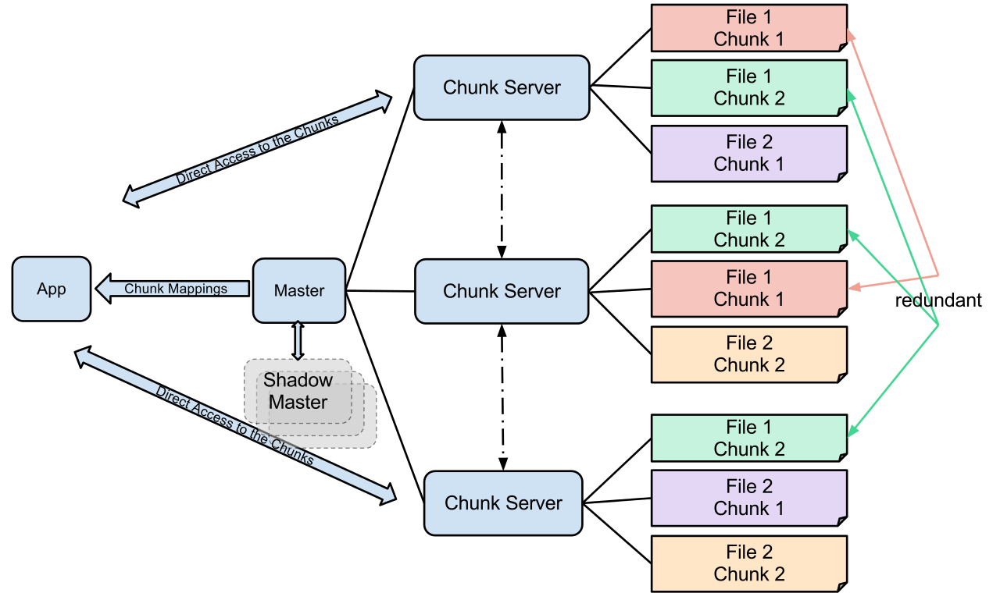
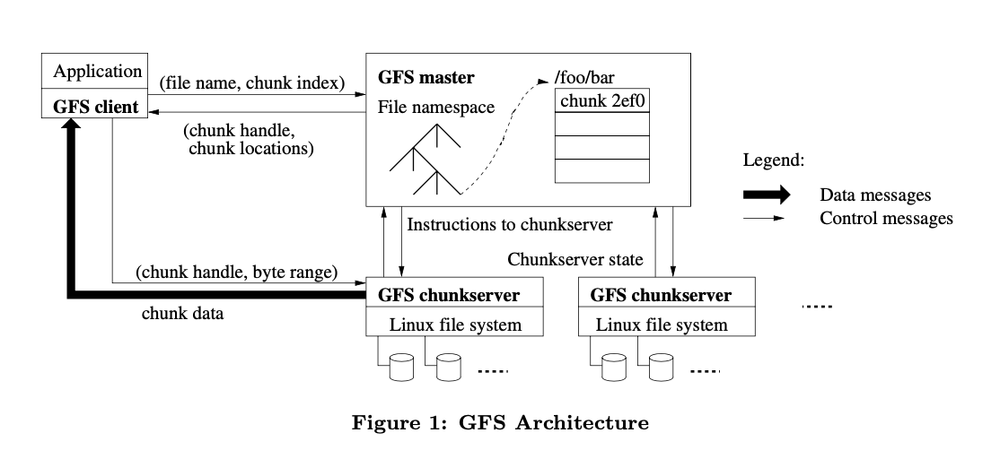
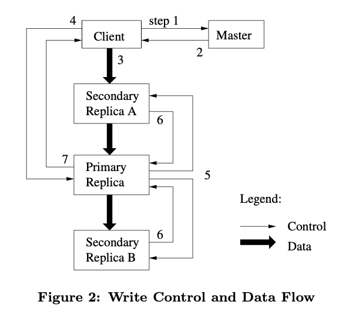
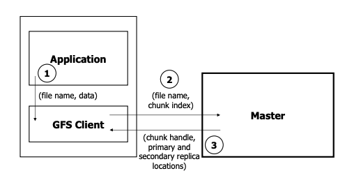
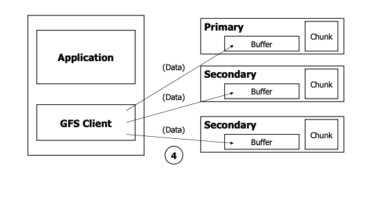
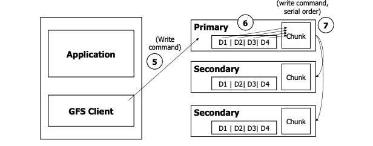
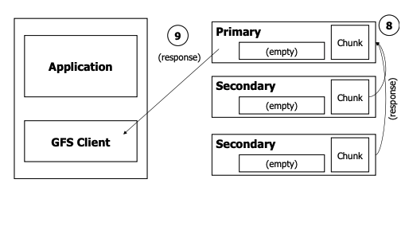
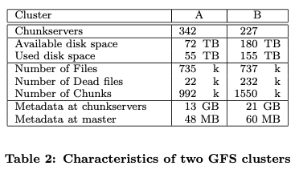

# GFS

- Lecture Note: http://nil.csail.mit.edu/6.824/2020/notes/l-gfs.txt
- Paper: https://pdos.csail.mit.edu/6.824/papers/gfs.pdf

This paper itself is already a summary of contents. So in this document(summary), I tried to write down some key points like ***2. DESIGN OVERVIEW***, ***3. SYSTEM INTERACTIONS**,* 그리고 ***5. FAULT TOLERANCE AND DIAGNOSIS***.

## References

- [Wikipedia: GFS](https://en.wikipedia.org/wiki/Google_File_System)
- [Youtube: Google File System - Paper that inspired Hadoop (12:24 분 분량)](https://youtu.be/eRgFNW4QFDc)
- [GFS 관련 강의 자료(course.cs.washington.edu, course - cse409h)](https://courses.cs.washington.edu/courses/cse490h/11wi/CSE490H_files/gfs.pdf)
- [Heartbeat implementation with Python](https://github.com/BenningtonCS/GFS/blob/master/heartBeat.py)
- [Wikipedia: Metadata](https://en.wikipedia.org/wiki/Metadata)
- [Wikipedia: POSIX](https://en.wikipedia.org/wiki/POSIX)
- [티스토리: [Study] Copy on Write (COW), 생각많은 소심남](https://talkingaboutme.tistory.com/entry/Study-Copy-On-Write-COW)

## Backgrounds

Google File System (GFS or GoogleFS, not to be confused with the GFS Linux file system) is a proprietary distributed file system developed by Google to provide efficient, reliable access to data using large clusters of commodity hardware.

### Commodity Hardware

Commodity hardware means cheap servers. It indicates servers that are affordable and easy to obtain, even in large quantities.

System is built from many inexpensive commodity components that often fails.

### Files, Operations

Files are divided into fixed-size chunks of 64 megabytes, similar to clusters or sectors in regular file systems, which are only extremely rarely overwritten, or shrunk; files are usually appended to or read.

Read

The workload primarily consist of two kinds of reads

- Large streaming reads
- Small random reads

Write

The workload also have many large, sequential writes that append data to files. Once written, files are seldom modified again. Small writes at arbitrary positions in a file are supported but do not have to be efficient.

### Interface

GFS does not provide a POSIX interface. Files are organized hierarchically in directories and identified by pathnames. The file operations such as *create, delete, open, close, read, write* are supported. It supports Record Append which allows multiple clients to append data to the same file concurrently and atomicity is guaranteed.

### Architecture

A GFS cluster consists of a single ***master*** and multiple ***chunk servers*** and is accessed by multiple *clients(app uses GFS client)*.

#### Chunks

##### Stored files on GFS is divided into fixed-size *chunks*. What is a chunk?

- Analogous(유사한) to block, except larger.
- Identified by an immutable and globally unique 64 bit *chunk handle*(~ chunk file name) assigned by the master at the time of chunk creation.
- Size: 64MB.
- Stored on chunkserver's local disks as Linux files and byte range.
- Chunk replicated across multiple chunk servers.

##### Chunk size.

Chunk size is one of the key design parameters. GFS choses 64 MB. It is much larger than typical file system block size. Why?

A large chunk size offers several important advantages.

1. It reduces clients' need to interact with the master because reads and writes on the same chunk require only one initial request to the master for chunk location information.
2. it can reduce network overhead by keeping a persistent TCP connection to the chunkserver over an extended period of time.
3. Reduce the size of the metadata stored on the master.

#### Master

##### Metadata

The master stores three major types of metadata: the file and chunk namespaces, the mapping from files to chunks, and the location of each chunk replicas.

All the metadata is kept in the master's memory.

The file and chunk namespaces and the mapping from files to chunks are also kept persistent by logging mutations to an *operation log* stored on the master's local disk and replicated on remote machines.

One potential concern for this memory-only approach is that the number of chunks and hence the capacity of the whole system is limited by how much memory that master has. 

Actually, this is not a serious limitation in practice. The master maintains less than 64 bytes of metadata for each 64 MB chunk. And the file namespace data typically requires less than 64 bytes per file because it stores file names compactly using prefix compression.

Master does not keep a persistent record of which chunkservers have a replica of a given chunk. It simply polls chunkservers for the information at startup. The master can keep itself up-to-date thereafter because it controls all chunk placement and monitors chunkserver status with regular HeartBeat messages.

The operation log contains a historical record of critical metadata changes. It is central to GFS. Not only is it the only persistent record of metadata, but it also serves as a logical time line that defines the order of concurrent operations. Files and chunks, as well as their versions are uniquely and eternally identified by the logical times at which they were created. Since it is very critical, GFS replicated it on multiple remote machines and respond to a client operation only after flushing the corresponding log record to disk both locally and remotely.

Master can recovers its file system state by replaying the operation log.

It also makes checkpoint to minimize startup time(also to keep log file as small).

##### Master also controls system-wide activities.

Chunk lease management, garbage collection of orphaned chunks and chunk migration between chunkservers.

##### GFS must minimize master's involvement in reads and writes so that it does not become a bottleneck.

Client never read and write file data through master. Instead, a client asks the master which chunkservers it should contact.

#### GFS client

Co-designing the applications and the file system API benefits the overall system by increasing our flexibility.

GFS client code linked into each application implements the file system API and communicates with the master and chunkservers to read or write data.

Client interacts with the master for metadata operations.

Client caches this information for a limited time and interacts with the chunkservers directly for many subsequent operations.

Client directly interacts with the chunkservers data-bearing communications.

### Read

Note, Application uses GFS client. And there are two types of messages. Data messages and Control messages.

1. Using the fixed chunk size, the client translates the file name and byte offset specified by the application into a chunk index within the file. Then, it sends the master a request containing the file name and chunk index.
2. The master replies with the corresponding chunk handle and locations of the replicas. Client caches this information using the file name and chunk index as the key.
3. The client sends a request to one of the replicas, most likely the closes one. The request specifies the chunk handle and a byte range within the chunk. 

#### Heartbeat

[Heartbeat implementation with Python](https://github.com/BenningtonCS/GFS/blob/master/heartBeat.py)

### Data Mutation

The master grants a chunk lease to one of the replicas, which we call the *primary*.

A mutation is an operation that changes the contents or metadata of a chunk such as write or an append operation. Each mutation performed at all the chunk's replicas. GFS use leases to maintain a consistent mutation order across replicas. The primary picks a serial order for all mutations to the chunk. All replicas follow this order when applying mutations.

Global mutation order is defined by,

1. By the lease grant order chosen by the master.
2. Within a lease by the serial number assigned by the primary

**Lease**,

A lease has an initial timeout of 60 seconds. However as long as the chunk is being mutated, the primary can request and typically receive extensions for the master indefinitely.

These extension requests and grants are piggybacked on the HeartBeat messages reg- ularly exchanged between the master and all chunkservers.

Even if the master loses communication with a primary, it can safely grant a new lease to another replica after the old lease expires.

#### Write

1. Client asks to the master which chunkserver holds the current lease for the chunk and the locations of the other replicas.

- If no one has a lease, the master grants one to a replica it chooses.

2. The master replies with the identity of the primary and the locations of the other (secondary) replicas.

3. The client pushes the data to all the replicas. A client can do so in any order. Each chunkserver will store the data in an internal LRU buffer cache until the data is used or aged out.

4. Once all the replicas have acknowledged receiving the data, the client sends a write request to the primary. The request identifies the data pushed earlier to all of the replicas. The primary assigns consecutive serial numbers to all the mutations it receives, possibly from multiple clients, which provides the necessary serialization. It applies the mutation to its own local state in serial number order.

5. The primary forwards the write request to all secondary replicas. Each secondary replica applies mutations in the same serial number order assigned by the primary.

)

6. The secondaries all reply to the primary indicating that they have completed the operation.

7. The primary replies to the client.

### High Availability

GFS is consists of commodity hardware. Among hundreds of servers in a GFS cluster, some are bound to be unavailable at any given time. What is the strategy for this on GFS? 

#### Fast Recovery

Both the master and the chunkserver are designed to re-store their state and start in seconds no matter how they terminated.

Each individual server, both chunkservers and the master, has only 50 to 100 MB of metadata. Therefore recovery is fast: it takes only a few seconds to read this metadata from disk before the server is able to answer queries. However, the master is somewhat hobbled for a period – typically 30 to 60 seconds – until it has fetched chunk location information from all chunkservers.

#### Chunk Replication

Each chunk is replicated on multiple chunkservers on different racks. Chunk replicas are created for three reasons

- Chunk creation.
- Re-replication.
- Rebalancing.

When master creates a chunk, it chooses where to place the initially empty replicas. It considers several factors.

- GFS wants to place new replicas on chunkservers with below-average disk space utilization.
- GFS wants to limit the number of "recent" creations on each chunkserver.
- GFS wants to spread replicas of a chunk across racks.

Master picks the highest priority chunk and "clones" it by instructing some chunkserver to copy the chunk data directly from an existing valid replica. 

Master rebalances replicas periodically. It examines the current replica distribution and moves replicas for better disk space and load balancing. 

#### Master Replication

The master state is replicated for reliability. Its operation log and checkpoints are replicated on multiple machines. A mutation to the state is considered committed only after its log record has been flushed to disk locally and on all master replicas.
