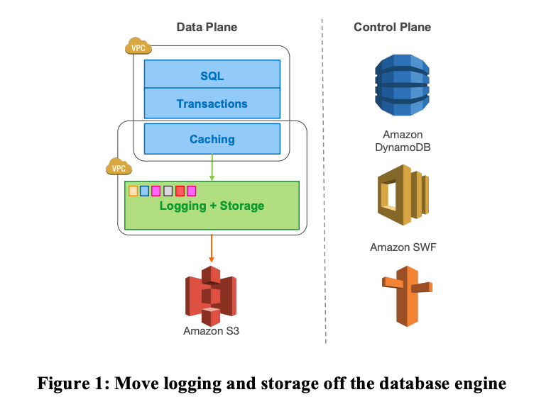

# L10: Cloud Replicated DB, Aurora

논문: https://pdos.csail.mit.edu/6.824/papers/aurora.pdf

## ABSTRACT

OLTP Workload 를 분산 구조에서 효율적으로 처리하기 위한 Architecture.

## Keywords

Databases; Distributed Systems; Log Processing; Quorum
Models; Replication; Recovery; Performance; OLTP

# 1. INTRODUCTION

- 많은 회사들이 Public Cloud Provider 를 사용한다.
  - 유연한 가격 정책과 운영 비용을 줄이기 위해
- Distributed Cloud Services for resilience and scalability
  - compute 와 storage 를 분리하고
  - storage 를 multiple nodes 로 replicate 한다
- 기존의 OLTP database 를 사용하게 되면
  - 이런 Cloud 환경에서 Disk 하나에 bottleneck 이 걸리는 경우는 줄지만
  - 반대로 이 병목이 IO tier 로 넘어간다
    - between database tier requesting IO and the storage tier that perform these IO
  - **이 환경에서 어떻게 Scalable 한 Database 를 만들 수 있을까?**



# 2. DURABILITY AT SCALE

_Durability_: _the ability to withstand wear, pressure, or damage._
_Database가 단 한가지 역할을 해야 한다면, 결국 한번 쓰여진 데이터는 읽혀야 한다는 것이다._
**_Quorum Model + Segment Storage → Durability_**

## 2.1 Replication and Correlated Failures

- 여기서 Correlated Failures 란 데이터센터 전체 (AZ)의 실패를 의미한다.
  - 개별 노드의 실패는 서로 uncorrelated 하지만 AZ의 실패는 Correlated 하다고 표현함.
- Instance lifetime ≠ storage lifetime
  - Instance 는 고객들 로드에 맞게 resize 되어야 하기 때문에 storage tier 와 computer tier 가 분리되면 좋고,
  - 고객이 (컴퓨팅 레벨에서의 로직이) 성공하더라도 storage 레벨에서 실패할 수 있기 때문에 failure에 resilent 한 구조여야 한다.
    - node - background noise 계속 발생 : network, disk 실패 등에서 어떻게 자유로울 수 있을까?

**Quorum-based Voting Protocol**

[https://en.wikipedia.org/wiki/Quorum\_(distributed_computing)](<https://en.wikipedia.org/wiki/Quorum_(distributed_computing)>)

A quorum is the minimum number of votes that a distributed transaction has to obtain in order to be allowed to perform an operation in a distributed system.

- `V` : copies of a a replicated data
- `Vr` : a read quorum
- `Vw` : a write quorum

**To acheive consistency, 2 rules!**

1. `Vr + Vw > V`

- each read must be aware of the most recent write
- `len([1, 2, 3]) + len([3, 4, 5]) > len([1, 2, 3, 4, 5])`
  - 3이라는 교집합이 존재해야 한다는 의미!

2. `Vw > V/2`

- each write must be aware of the most recent write → avoid conflict!

(교수님: Quorum 시스템은 version number 가 있어서 어떤게 최신인지 파악할 수 있어야 한다. 어떤게 최신인지 파악하기 쉽게하려고..! 그리고 Quorum을 쓰면 제일 빠른 서버들의 응답을 보면 되기 때문에 갑자기 느려지거나 망가진 서버를 기다리지 않아도 됨. R = 1, W = 3 로 설정하면 read 가 빠름 하지만 W는 느리고, not fault-tolerant)

그래서 보통 Single node 의 데이터 손실을 막기 위해서는 V = 3, Vw = 2, Vr = 2 를 사용하나 Aurora 는 V=6, Vw=4, Vr=3 를 사용함.

- 이유는 AWS 는 보통 한 Region 안에 서로 고립되어 있는 Availability Zone 을 두고, data replica 를 여러 AZ 에 걸쳐서 저장하는데, 3개의 복사본을 각각의 AZ에 위치시키면 개별 노드의 실패에는 tolerant 하다.
- 근데..!! A, B, C 3개의 AZ 에 replica 3개가 존재한다고 했을 때
  - AZ C가 화재나 홍수로 인해 실패하고 동시에 faulure 가 AZ A나 B에 발생하면 합의체 자체가 깨지게 된다. A, B 둘 중 1개에만 데이터가 존재하기 때문에 최신인지 알 수 없다.
- 그래서 각 개별 node의 noise 로 인한 실패 뿐만이 아니라 AZ 자체의 문제로 인한 실패에도 Fault Tolerant 해야 한다.

- 그래서
  - 6개의 Replica 를 각 2개씩 3 AZs 에 저장하고 (V=6)
  - 1개의 AZ가 실패하고, 나머지 AZ에서 1개의 node 가 실패 하더라도 (3개의 replica 실패) → Read 가 가능하도록 Vr = 3으로 설정하고
  - 1개의 AZ가 완전히 실패하는 것을 포함해 개별 node 2개가 실패하더라도 (총 2개의 복사본이 망가지더라도), Vw = 4 이기 때문에 Write 도 가능하도록 설계함

## 2.2 Segmented Storage

volume 을 fixed segment 로 나누어 MTTR Repair 속도를 높인다.

- 앞에서 correlated 실패에 대한 durability 를 높였다면
  - 여기서는 **uncorrelated failures 사이의 시간 간격, 연속적인 실패에 대한 durability 를 높이는 방법**에 대해서 설명한다.
  - Mean Time to Failure (MTTF) 보다 **Mean Time to Repair** 가 빨라야 durable 하다고 할 수 있다
  - 서로 관련 없는 실패들의 Mean Time 을 줄이는 것은 어려우니, **Mean Time to Repair 를 줄이는 방법에 대해서 생각해보자**
- Aurora 가 채택한 방식은?
  - Small Fixed Size Segments (10GB) 들로 Database Volume 을 파티셔닝 하는 것!!
  - 10GB로 쪼개진 Segment는 각 AZ에 2개씩 복사되어 하나의 Protection Group 이 됨.
    - → 서버 SSD (Storage Volume) 에 concatenated set of PGs 가 저장됨.
    - 10GB segment can be **repair faults in 10 secs on a 10 Gbps network link.**

## 2.3 Operational Advantages of Resilience

- 긴 실패에 대응할 수 있는 시스템 디자인은 shorter one 에도 resilient 함.
  - 요 resilient 한 디자인 덕에 운영상 이점도 따라온다.
    - segment 하나가 Disk Hot 으로 인해 실패하면 quorum 이 재빨리 다른 colder node 에 복구시킨다거나 (Heat Management), Software 업그레이드도 하나의 PG에는 1개 이상의 복사본이 있는 노드를 동시에 업데이트 하지 않기 때문에 OS patch 나 Software deployment 도 agile 하게 할 수 있음! 좋음!

# 3. THE LOG IS THE DATABASE

How to leverage smart storage by offloading the lower
quarter of a traditional database to this tier.

기존의 traditional database 구조를 그대로 가져가면 앞에서 설명한 replicated storage system 의 network IO 에 짐덩이가 될 수 있는데 여기서는 이 네트워크 병목을 줄일 수 있는 방법에 대해서 설명함

## 3.1 The Burden of Amplified Writes

- High Resilience → MySQL 과 같은 기존 DB에는 untenable performance

  - 각 어플리케이션의 write 에 다양한 IO 를 발생시키는데 replication 배수로 늘어나는 만큼 IO 양도 배수로 늘어남 = heavy packets per second (PPS)
  - 작업 절차절차마다 늘어나는 iO → latency 늘어남

  **How writes work in a traditional database like MySQL**

  - writes data pages to objects (heap files, b-trees), redo logs to write-ahead log (WAL)

    - redo logs, binary (statement) log (archived s3),.. double write, meta data (FRM Files)...
    - mirroring 까지 하면 ?

      - MySQL → Standby MySQL
      - EBS도 → Standby EBS

      데이터의 양도 많고, 1, 3, 5가 sequential 한 작업이기 때문에 latency 가 계속 증가함.


## 3.2 Offloading Redo Processing to Storage

_the log is the database, pages are simply a cache of log applications_

- Only writes redo log cross the network!
- log applicator 가 storage tier 로 push 되고 generate database pages in background.
  - storage system은 로그를 이해하고 page를 만들 수 있는 시스템. for aurora


- 30분 동안 처리한 transactions 수도 35배 많고, Transaction 당 발생한 IO 수는 훨씬 줄였다.


## 3.3 Storage Service Design Points

minimize the latency of the foreground write request

- we **moved** the majority of storage processing **to the background**

  - Aurora에서는 background processing과 foreground processing 을 분리

    

  **Step**

  **Foreground**

  (1) receive log record and add to an **in-memory queue**

  (2) persist **record on disk** and acknowledge

  ***

  **Background**

  (3) organize records and **identify gaps in the log** since some batches may be lost

  (4) gossip with peers to **fill in gaps**

  (5) coalesce log **records into new data pages,**
  (6) periodically stage log and new pages to S3,

  (7) periodically garbage collect old versions,

  (8) periodically validate CRC codes on pages.

  - CRC? Cyclic Redundancy Code. 파일 일부가 손상되지 않았는지 확인하기 위해 데이터에 덧붙여 보내는 코드.

  Note that not only are **each of the steps above asynchronous, only
  steps (1) and (2) are in the foreground path potentially impacting
  latency**

# 4. THE LOG MARCHES FORWARD

How to eliminate multi-phase synchronization, crash
recovery and checkpointing in distributed storage

log processing 간 consistency 를 맞추기 위해서 무엇을 해야하는지?

- 결국 Log Sequence Number 가 항상 증가한다는 걸 이용함.

## 4.1 Solution sketch: Asynchronous Processing

database 와 상관없이 storage 레벨에서도 데이터가 분산되어 있더라도 어디가 최신인지 알고, recovery 를 할 수 있어야 함.

- 여기서는 runtime 이든 replica state 든 Consistency 일관성을 유지하는 방법을 설명

- 모든 로그 레코드는 **LSN (Log Sequence Number)**를 가지고 있음
  - (monotonically increasing value generated by the database)
- PG Complete LSN: DB가 4/6 segment (quorum) 충족했을 때
- **Volume Complete LSN (VCL)**: storage determins the highest LSN for **which it can guarantee availability of all records** (모든 레코드(모든 PGs)가 **쿼럼을 충족한 경우의 LSN**)

  - when DB sees PGCL at all PGs
  - Storage recovery 때는 VCL 보다 큰 LSN 은 truncate 됨
  - 하지만 **database 는 좀 더 constraint 를 줄 수 있는데, 이를 CPL (Consistency Point LSN)** 이라고 함 → a subset of points that are allowable for truncation by tagging log records. Final log record of MTR
  - **Volume Durable LSN(VDL)** : the highest CPL that is smaller than or equal to VCL

  **예시**

  - LSN 1007 일 때 database 는 only 900, 1000, 1100 이 CPL (Consistency point LSN) 이라고 하면 , 1000으로 truncate 해야 함.
    - we are complete to 1007 but only durable to 1000
  - Completeness 와 Durability는 다름
  - In practice the database and storage interact
    - Database level transaction = **multiple mini transactions ordered**
    - each mini transactions = **multiple contiguous log records**
    - **final log record** in a mini-transaction (MTR) **= CPL**

## 4.2 Normal Operation

### 4.2.1. Write

- database 가 storage 와 얘기하면서 state 를 유지하는데
  - 보통 write 때 **log records batch** 마다 **write quorum** 이 estabilish 되었다는 acknowledgement 를 받으면 database가 **current VDL 를 올린다**.
- transaction이 대량으로 만들어질 거고 그 transaction에 의해 만들어진 redo logs 에 대해 database는 unique ordered LSN 을 발급한다.
  - 이때 발급하는 **LSN < current VDL + LSN Allocation Limit** ( 10 millions ) 를 합한 Number를 초과하면 안된다.
    - 즉, Database 가 Storage 에 비해 너무 앞서 있지 않도록 한다 (Storage, network 에 back-pressure 를 주지 않기 위해서)
- Protection Group (PG) 내의 Segment 들은 자신의 page에 영향을 주는 log record만 보는데
  - 이 때 log record 는 PG의 **prevous log record 가 뭔지 알려주는 backlink (Segment Backlink)** 를 가지고 있다
    - 이 backlink를 통해 completeness 를 체크한다.
    - 여기서 **Segment Complete LSN (SCL)** 이라는 개념이 나오는데
      - SCL 이란 그 LSN 아래에 있는 PG 내 모든 record 를 받았음을 의미한다.
      - 즉 "각 Storage의 segment 가 segment backlink를 이용해서 유지하는 LSN"
      - storage node 가 서로 빠져있는 로그들을 찾고 교환할 때 이 개념을 사용한다.

### 4.2.2 Commits

- Transaction Commits 은 completely asynchronously
- client 가 commit 하면 commit을 핸들링하는 thread 가 commit 을 기다리는 transaction list 와 commit LSN 을 기록함
  - 그러고 커밋하는 동안 다른 일 수행한다

### 4.2.3 Reads

- 다른 데이터베이스와 마찬가지로 pages 가 buffer cache 에 있냐 없냐에 따라서 storage IO request 가 발생한다
- buffer cache 가 꽉차면 victim page 를 찾아야 하는데

  - 기존 DB들은 최신 데이터를 읽어오기 위해 dirty page 를 내보낸다.
    - dirty page? buffer cache에 기록되었지만 disk 에 저장되지 않은 changed page
      - [https://www.sqlshack.com/sql-server-checkpoint-lazy-writer-eager-writer-and-dirty-pages-in-sql-server/](https://www.sqlshack.com/sql-server-checkpoint-lazy-writer-eager-writer-and-dirty-pages-in-sql-server/)
  - aurora 는 약간 다른 방식으로 a page in the buffer cache는 항상 최신 버전이어야 한다 는 것을 보장한다
    - → page LSN 이 VDL 보다 크거나 같을 때 page 를 쫓아낸다.

- Disk 를 읽을 때(read)는 quorem read 가 아니라 **single segment reads** 를 한다.
  - (quorem read) 는 crash 나거나 recovery 할 때 사용
  - 어떻게?
    - disk 에서 page를 읽을 때, database 가 **read-point - request 가 만들어진 시점의 VDL** 을 establish
      - 그러고 database 가 각 storage에서 해당 read-point에 complete 한 storage node 를 선택할 수 있다.

### 4.2.4. Replicas

- Aurora 에서 a single writer ~ up to 15 read replicas 가 a single shared storage volume 을 mount

  - no additional storage or disk is needed
  - To minimize lag , the log stream generated by the writer sent to the storage nodes also sent to all read replicas
  - 로그 records 가 해당 reader 의 buffer cache 내 page 를 언급하면

    - redo operation 을 수행하고 해당 페이지에.
    - 그렇지 않으면 로그 records 를 버린다.

      - consistency 를 위해서 적용할 때 두가지 rule 을 따른다

        - a) log records 를 적용할 때에는 현재의 VDL 보다 작거나 같은 경우의 로그만 적용
        - b) 하나의 mini-transaction 의 일부인 log record 가 atomic 하게 적용됨

          - Atomicity

            하나의 원자 트랜잭션은 모두 성공하거나 또는 실패하는 데이터베이스 운용의 집합이다 [https://mygumi.tistory.com/111](https://mygumi.tistory.com/111)

    - **writer 의 관점에서 reader 가 log 를 읽어들이 건 async** 하다는 걸 여기서 강조함.
    - 이렇게 다 했을 떄 보통 reader 와 writer 사이의 lag 는 20ms 나 그 이하임.

## 4.3 Recovery

**Traditional Database**

- ARIES recovery protocol 사용
  - Write-ahead log (WAL) 이 전체 commit 된 logs 를 담고 있고 (disk write 전에 저장되는 로그)
  - system 이 주기적으로 checkpoint 를 생성함
- 그리고 crash recovery 때 각 checkpoint 로부터 redo log records 를 처리하면서 missing page 를 채움.
  - 이 crash recovery 를 expensive 한 작업이고, checkpoint 저장 주기를 짧게 가져간다고 해도 foreground transaction 을 간섭하는 비용이 생김. Aurora에서는 이런 tradeoff 가 발생하지 않음!

Aurora에서 redo log applicator 는 **database 와 분리되어 병렬적으로** storage nodes 에 적용하며

- 항상 **background** 에서 돌아간다
- database 가 시작되면 volume recovery를 하는데, Aurora 는 10 초 내로 recover 가능하다
  - 초당 10만 write statements 를 처리하다 crash 가 나더라도!
- 데이터베이스가 runtime state를 복구할 때에는
  - 각 PG의 read quorum 을 보고 VDL 을 다시 계산한다.

(생략)

5. PUTTING IT ALL TOGETHER

6. PERFORMANCE RESULTS

7. LESSONS LEARNED

8. RELATED WORK

...

# 9. Conclusion

- Aurora 굉장히 high throughput OLTP database 이다
- monolithic architecture → decouple storage from compute
- network 문제에 집중
  - quorum model 로 failures 를 다루고, log processing 으로 IO burden 을 줄이고, asynchronous consensus 를 사용

## References

[https://www.slideshare.net/AmazonWebServices/amazon-aurora-storage-demystified-how-it-all-works-dat363-aws-reinvent-2018](https://www.slideshare.net/AmazonWebServices/amazon-aurora-storage-demystified-how-it-all-works-dat363-aws-reinvent-2018)

---

## 강의

**도입부**

- EC2 가 에러나면 웹서버는 다시 뜨면 되는데, DB에서는 데이터가 손실되면 치명적임
- S3를 통해 스냅샷을 찍어서 문제 생겼을 때 복구했는데 요걸로 충분치 않음
- EBS 도입 - permanant 데이터를 안전하게 저장
  - EC2 데이터 → EBS 저장 → Standby EBS에 저장
  - each ebs는 동시에 한 ec2만 접근할 수 있다
- 네트워크 병목 & 데이터 센터 다운에 대한 대응은 못함

**DB Tutorial - Transaction and Crash Recovery**


```bash
BEGIN
    X = X + 10
    Y = Y - 10
END
```

- lock x, y
- data pages (b-tree),
  - WAL (write ahead log)
    - (old) x = 500, (new) x = 510
    - (old) y = 750, (new) y = 740
    - Commited or not
- 네트워크 병목이

  - 로그 뿐만 아니라 페이지, 데이터 블록을 보내니까 심해짐

  Storage Server

  - page + with old page version + 관련된 log record 가 같이 저장됨
  - PG는 각자 연관있는 log records 를 저장하고 있어야 함
  - 서버 1개에 각각 다른 PG 의 segment 를 위치시킴으로써
    - **병렬적으로** 데이터를 각각 다른 서버에서 복사해 복구할 수 있다!

  
