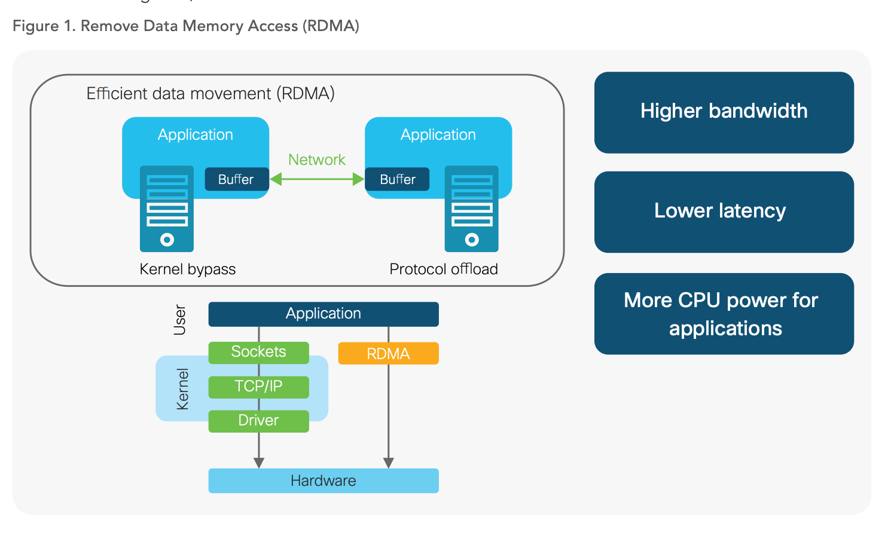

# L14: Optimistic Concurrency Control

논문: https://pdos.csail.mit.edu/6.824/papers/farm-2015.pdf

# No compromises: distributed transactions with consistency, availability, and performance (2015)
# Abstraction

- 어떻게 transaction system 에서 high availability, consistency 를 보장하면서도 속도를 유지할 수 있을까?
    - 2014 년 마.소 논문에서 발표한 **FaRM(Fast Remote Memory)** 에 대한 얘기이다.

        **a main memory distributed computing platform**

        [https://www.microsoft.com/en-us/research/publication/farm-fast-remote-memory/](https://www.microsoft.com/en-us/research/publication/farm-fast-remote-memory/)

## RDMA

- Remote Direct Memory Access
- **allows computers in a network to exchange data in main memory** without involving the processor, cache or os
- 메인 메모리끼리 데이터를 주고 받는 것
- 빠른 데이터 처리와 낮은 네트워크 지연시간으로 대규모 데이터 센터에서 활용

강의)

## Optimistic Concurrency Control

[https://soranta.tistory.com/11](https://soranta.tistory.com/11)

동시성 제어(Concurrency Control)

- 데이터 무결성 안에서 동시 트랜잭션 수 최대화하기 위한 것
- 트랜잭션의 실행 순서를 제어
- 비관적 동시성 제어 (Pessimistic concurrency Control)
    - 비관적 동시성 제어란 데이터를 읽는 시점에 Locking을 걸고 트랜잭션이 완료될 때까지 이를 유지하는 것
- 낙관적 동시성 제어(Optimistic concurrency control)
    - Execution → Validation → Logging → Commit
    - 먼저 실행하고, 트랜잭션 종료 때 일괄 검사함

[https://www.usenix.org/system/files/osdi18-wei.pdf](https://www.usenix.org/system/files/osdi18-wei.pdf)

# 1. Introduction

Dynamo or Memcached improve performance by either not supporting transactions or by implementing weak consistency guarantees

- This paper demonstrates that new software in modern data centers can **eliminate the need to compromise.**
- data centers trend
    - fast commodity networks with RDMA
    - inexpensive non-volatile DRAM
- storage & network bottleneck 을 줄이지만 CPU bottleneck?
    - FaRM 은 CPU bottleneck 을 더 줄이는 데에 초점을 맞춤

# 2. Hardware trends

non-volatile DRAM & one-sided RDMA

- DRAM 이 plentiful and cheap (요샌 아닌거같은데..)
    - $12/GB
    - typical data center configuration: 128-512GB of DRAM per 2 socket machine
    - → 1PB: 2000 machines
- Hardware trend
    - **eliminate storage and network bottleneck**
        - **using non-volatile DRAM and fast commodity networks with RDMA**

## 2.1 Non-volatile DRAM

- power failure → distributed UPS (Power Supply) saves the contents of memory to SSD
    - power 가 나갈 때 배터리를 통해서 DRAM 의 내용을 SSD 에 옮겨쓴다.
    - SSD 로 동기화하는 작업을 줄이고, failure 때만 SSD 에 write 하기 때문에 lifetime of the SSD 를 증가시킴

## 2.2 RDMA networking

- FaRM 1-sided RDMA 사용
    - do not use remote CPU

    

- One-Sided RDMA?
    - diretly access of remote memory without involving kernel & remote CPUs
    - **Sender(Client)** - **Receiver(Server)** 통신 위한 **Queue** 가 있음
    - RDMA request by posting the requests (called Verbs) to the **sender queue**
    - polling a completion queue

    

    [https://www.usenix.org/system/files/osdi18-wei.pdf](https://www.usenix.org/system/files/osdi18-wei.pdf)

    참고) For two-sided RDMA, the server polls requests from a receiver queue, calls a local RPC routine and posts results back to the sender queue.

# 3. Programming model and architecture

FaRM Architecture

- FaRM 은 클러스터 내의 머신들을 확장시켜 **global address space 를 추상화한 어플리케이션(API)을 제공**
- 각 machine → run application threads and store objects in the address space
- 각 application → start a transaction at any time and becomes the transaction's coordinator
    - thread can execute arbitrary logic read, write, allocate, free objects 를 포함해서!
    - **at the end of the execution: thread invokes Farm to commit the transaction**
- **FaRM transaction use optimistic concurrency control**
    - 실행하는 동안 업데이트는 **로컬 버퍼에 저장되고 커밋이 성공해야 다른 트랜잭션이 해당 업데이트를 확인할 수 있음**

- Each machine runs FaRM in a user process with a kernel thread
    - Each kernel thread runs **an event loop that executes application code and polls
    the RDMA completion queues**

- 머신이 실패하거나 새로 더해지면 a sequence of configurations 수행
    - <i, S, F, CM>
        - i: configuration ID
        - S: sets of machines
        - F: mapping S → failure domains
        - CM: configuration manager CM in S
    - 주키퍼는 failure recovery 에 활용된다기 보다 설정을 저장할 때 CM 에 의해 불러와짐.
        - Zookeeper: coordination service to ensure machines **agree on the current configuration and to store it**
        - CM 이 recovery 로직을 가지고 있음

- FaRM 에서 global address space 는 2GB regions
    - each replicated 1 primary, f backups (fault tolerance)
    - 각 machine 이 해당 공간을 nv-DRAM 에 저장하고,
        - 읽으려는 데이터가 로컬에 있다면 로컬머신에서,
        - 다른 machine 에 의해서는 one-sided RDMA를 통해 읽힘
- The mapping of **a region identifier** to its primary and backups is **maintained by the CM**

# 4. Distributed transactions and replication

Optimistic Consistency Control

- FaRM 은 성능향상을 위해 **transaction 과 replication protocol 을 합침**
    - 장점: fewer message 를 사용함
        - one sided RDMA (read, write)for CPU, low latency
        - 그리고 data와 transaction log 모두를 primary-backup 에 replicate 한다
        - transaction coordinator 는 프라이머리와 백업에 직접 소통하는데 이 아이는 복제되지 않음

            

앞에서 얘기한 거)

- 각 application → start a transaction at any time and becomes the transaction's coordinator
    - **at the end of the execution: thread invokes Farm to commit the transaction**
- **FaRM transaction use optimistic concurrency control**
    - 실행하는 동안 업데이트는 **로컬 버퍼에 저장되고 커밋이 성공해야 다른 트랜잭션이 해당 업데이트를 확인할 수 있음**

- **Optimistic Consistency Control**
- 크게 실행 단계와 커밋 단계가 있다

**Execution Phase**

- One sided RDMA 사용하여 데이터를 읽어와 local buffer 에 write 한다
- The coordinator also records the addresses and versions of all objects accessed.

**Commit Phase**

1) Lock

- coordinator 가  primary 애들한테 lock record 를 쓴다
    - version, new value, transaction ID 등등
- Primary : send back a message reporting whether all locks were successfully taken

2) Validation

- read 일 때 밸리데이션 수행
- object version check 를 통해 변한게 없는지 확인 (read validation)
    - read version 을 보니 변하면 abort 함

3) Commit Backup

- 각 백업에 write commit backup record to the non-volatile logs
- NIC 를 통해 ack 신호를 기다리기 때문에 cpu interrupting 이 없음
- lock log 와 보내는 내용이 같음

4) Commit Primary

- primary 는 각 오브젝트를 레코드를 보고 Object 업데이트 하고, version 올리고, unlocking 함

5) Truncate

- records 가 백업과 primary 에 남아 있으니까 해당 레코드를 truncate.
- truncation time 에 백업들은 copies 에 대해 업데이트 수행

# 5. Failure recovery

- durability, HA 를 위해서 replication 을 사용하며
- non-volatile DRAM 을 이용해 데이터를 잃어버리지 않음
- failure recovery 과정 설명 → 생략

# 6. Evaluation

생략

# 8. Conclusion

- **FaRM** provides **strictly serializable transactions with high throughput, low latency, and high availability**
- **Key to achieving this are new transaction, replication, and recovery protocols designed  to leverage commodity networks with RDMA and a new, inexpensive approach to providing non-volatile DRAM**