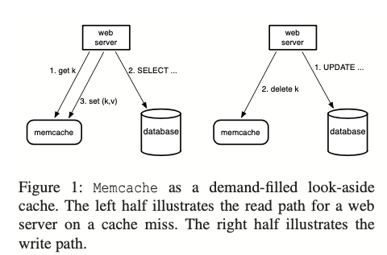
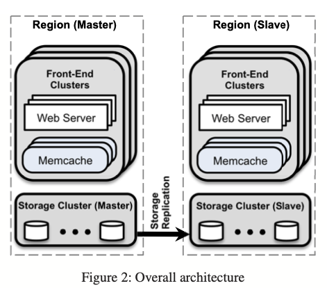
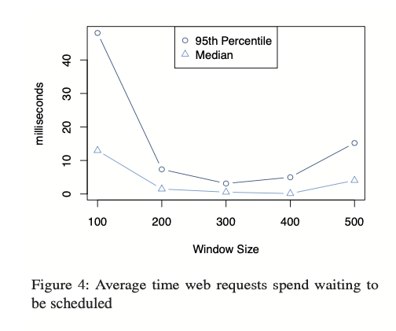
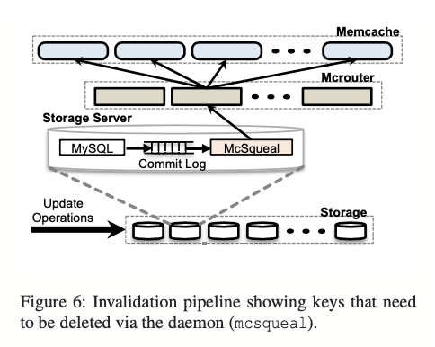
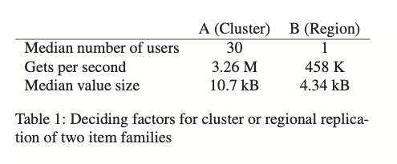

# L16: Cache Consistency: Memcached at Facebook

## Scaling Memcache at Facebook

* 이 논문에서는 *memcached* 와 *memcache* 를 구분해서 사용한다.

* *Memcached* 소스 코드나 돌아가고 있는 바이너리를 의미한다.
* *Memcache*는 *memcached*를 이용해 만든 분산 시스템을 의미한다.

### 1. Introduction

이 논문에서는 페이스북이 오픈 소스 버전의 *memcached*를 이용해 어떻게 효율적인 분산 키/값 저장소를 구축했는지를 다룬다. 분산 키/값 저장소라고 하면 다양한 솔루션들(Apache Cassandra, Couchbase,...)이 있지만, 이 솔루션이 (논문 작성 시점 기준) 가장 최신의 것이라 소개 한다.

이 논문에서 다루는 또 한 가지 중요한 사항은, 배포의 규모에 따라 performance, efficiency, fault-tolerance 그리고 일관성을 얻기 위해 들어가는 노력이 다르다는 것을 제시한다는 것이다. 페이스북의 경험에 따르면 특정 규모에서 특정 속성은 다른 것 보다 더 많은 노력을 필요로 한다. 즉 규모에 따라 다른 식으로 고민해야 한다는 것이다.

### 2. Overview

#### 디자인에 영향을 준 요소들

1. 사용자는 자신이 만든 것보다 훨씬 더 많은 컨텐츠를 소비한다.
2. 어플리케이션의 읽기 작업은 다양한 데이터 소스로부터 데이터를 읽어 온다. 대상은 MySQL 데이터베이스가 될 수도 있고 HDFS가 될 수도 있고 때로는 다른 백엔드 서비스가 될 수도 있다.

#### Memcached

왜 Memcached인가?

* *Memcached*는 대규모 분산 시스템에서 구성 요소로 사용하기에 매력적이다. 매우 심플한 오퍼레이션들(*set*, *get*, and *delete*)을 제공한다.

#### Query cache

* 페이스북에서는 데이터베이스의 부하를 낮추기 위해 *memcache*를 이용한다. Figure 1 과 같은 식이다.
  * 읽기 요청에 대해, 먼저 *memcache*에 *get(with string key)*하고 데이터가 있으면 반환, 없으면 데이터베이스에서 데이터를 가져온 뒤(*SELECT*) 캐시에 *set*한 뒤 반환한다.
  * 쓰기 요청에 대해, 먼저 데이터베이스에 변경을 하고(*UPDATE*) *delete(with string key)*을 *memcache*에 보낸다. *Memcache*에 있는 stale 데이터를 invalidate 하기 위함이다.
    * 캐시에 있는 데이터를 update하기 보단 delete 하는 방식을 택했다. 이는 delete가 idempotent 한 연산이기 때문이다. *Memcache*는 authoritative source of data(데이터의 주요 저장소 - 이 그림에서 데이터베이스)가 아니기 때문에 데이터를 evict 해도 안전하다.
* MySQL에서 튜닝을 통해 많은 읽기 트래픽을 감당하게 할 수도 있다. 그러나 페이스북은 *memcache* 를 별도로 두어 역할을 분리하는 방식을 선택했다. 첫 번째 이유는 제한된 엔지니어링 리소스와 시간이다. 두 번째 이유는 persistence 계층과 caching 계층을 구분해서 얻을 수 있는 이점들을 얻기 위함이었다.

#### Generic cache

데이터베이스의 캐시 말고도 *memcache*는 좀 더 일반적인 용도로 사용될 수 있다. 예를 들어 머신 러닝의 결과물들을 미리 계산해 넣어두는 용도로도 사용할 수 있다.

*Memcached*는 단일 서버에서 돌아가는 인메모리 hash table 이라고 할 수 있다. 논문의 나머지 부분에서는 페이스북이 이 *memcached*를 이용해 어떻게 페이스북의 워크로드를 감당할 수 있는 분산 키/값 저장소(*memcache*)를 만들었는 지를 다룬다.

#### 주요 관심사

* Read heavy workload
* Wide fan-out
* Provide consistent user experience as spread clusters around the world

#### 디자인 목표

* 모든 변경 사항은 사용자 대면 또는 운영 문제에 영향을 미쳐야 한다. 범위가 제한된 최적화는 고려되지 않는다.
* 일시적인 오래된 데이터를 읽을 확률을 responsiveness(반응성)과 유사하게 하나의 튜닝할 매개 변수로 취급한다. 반드시 최신의 데이터를 반환하게 하는 대신, 약간의 오래된 데이터를 노출하는 것을 통해 백엔드 스토리지의 과도한 부하를 방지하겠다는 것이다.

### 3. In a Cluster: Latency and Load

이 장에서의 챌린지는 수천 대의 서버로 확장해야 하는 것이다. 이 규모(**이 논문에서는 규모에 따라 고민하는 것을 주된 포인트로 삼는다*)에서 대부분의 노력은 캐시된 데이터를 가져오는 지연 시간이나 캐시 미스로 인한 로드를 줄이는 것이다.

#### Reducing Latency

하나의 클러스터에는 수백개의 *memcached*가 프로비저닝 되어 있고 각 아이템들은 *memcached* 서버에 *consistent hashing*을 이용해 분산되어 있다. 그렇기 때문에 웹서버들은 사용자의 요청을 처리하기 위해 많은 *memcached* 서버와 통신을 해야한다. 이런 구조라면, 모든 웹서버가 짧은 기간 동안 모든 *memcached* 서버와 통신을 해야 한다. 이런 *all-to-all* 통신 패턴은 *incast congestion*을 유발할 수 있고 하나의 서버가 여러 개의 웹 서버에게 병목이 되게 할 수 있다. 이를 방지하기 위해 데이터를 복제하는 것은 하나의 서버가 병목이 되게 하는 것을 방지하는 효과가 있지만 일반적인 경우에 메모리 효율성에 있어서 좋지 못한다.

페이스북에서는 주로 각 웹 서버에 있는 *memcache client* 를 통해 지연을 줄이도록 했다. 클라이언트는 serialization, compression, request routing, error handling 그리고 request batching 과 같은 다양한 기능을 제공한다. 클라이언트 가용한 서버의 목록을 갖고 있고 이 목록은설정 시스템을 통해 업데이트 된다.

* Incast congestion: TCP incast congestion happens in high-bandwidth and lowlatency networks, when multiple synchronized servers send data to a same receiver in parallel.

##### Parallel requests and batching

웹 어플리케이션 코드에서 웹 페이지에 대한 요청을 처리하기 위해 하는 network round trip을 최소화 하기 위한 구조화를 했다. 데이터 간의 의존성을 나타내는 DAG를 만들었다. 웹 서버는 이 DAG를 이용해 *동시에 가져올 수 있는 아이템의 개수*를 최대화 한다.

##### Client-server communication

*Memcached* 서버 끼리는 서로 통신하지 않는다. 적절하다고 판단될 경우 시스템의 복잡성을 캐시 서버가 아니라 상태가 없는 클라이언트에 추가한다. 이것을 통해 *memcached* 자체는 매우 단순하게 유지하며 제한된(단순한) 유즈케이스를 위한 성능 튜닝에 집중할 수 있다.

여기서 말하는 클라이언트 두가지 종류의 컴포넌트로 제공된다. 하나는 라이브러리이고 다른 하나는 *mcrouter*라 불리는 프록시 서버 형태이다. 이 서버는 *memcached* 서버의 인터페이스를 갖고 있는데, 요청과 응답을 다른 서버들에게 라우팅하는 역할을 한다.

클라이언트는 UDP 또는 TCP를 이용해 *memcached* 서버들과 통신할 수 있다. *get*을 할 때는 지연 시간 감소와 오버헤드를 줄이기 위해 UDP를 이용한다. UDP는 connection-less 이기 때문에 웹 서버들은 mcrouter를 우회해 *memcached* 서버와 직접 통신하는 게 허용된다.

UDP로 구현한 부분에서, 패킷이 드랍되거나 순서가 꼬이면 클라이언트 측에서 에러라고 판단한다. 이것을 복구하기 위한 메커니즘은 따로 구현하지 않았다. 그게 더 실용적이기 때문이다. 로드가 가장 심할 때 0.25% 정도의 리퀘스트가 드랍됐는데, 이 중 80%는 패킷이 늦거나 드랍되어 발생한 문제이고 나머지가 순서가 꼬여 발생한 문제였다. 클라이언트는 *get* 에러를 캐시 미스라고 판단하나 웹 서버는 추가적인 부하를 방지하기 위해 *memcached*에 데이터를 넣는 것을 스킵한다.

Reliability를 위해 클라이언트는 *set*과 *delete*을 할 땐 TCP를 사용하고 웹 서버와 같은 머신에서 실행되고 있는 *mcrouter*를 이용한다.

높은 쓰루풋을 위해 병렬성을 높인 웹 서버 쓰레드가 *memcached*와 TCP 연결을 위해 커넥션을 여는 것은 비싼 작업이다. *mcrouter*를 이용해 커넥션을 합치면 TCP 연결을 맺기 위해 사용되는 네트워크, CPU 그리고 메모리를 절약하는 것을 통해 효율성을 달성할 수 있다.

##### Incast congestion

*Memcache* 클라이언트는 incast congestion을 제한하기 위해 flow-control 메커니즘을 구현했다. 클라이언트가 많은 갯수의 키를 한 번에 요청하면 응답이 랙, 클러스터 스위치 등에 큰 부하를 줄 수 있다. 그렇기 때문에 클라이언트는 *outstanding request*의 수를 조절하기 위해 sliding window 메커니즘을 이용한다. 클라이언트가 응답을 받으면 다음 리퀘스트를 보낸다. TCP의 congestion control와 유사하게, sliding window의 크기는 성공적인 리퀘스트의 수에 따라 서서히 증가하고 응답을 받지 못 하는 경우가 생기면 감소한다.

An outstanding request is one which has not been served yet. For instance, an application could make 30 concurrent requests to different web servers. 10 of them may come back with a response, while the other 20 have not been serviced. Therefore, those 20 are outstanding since they are waiting for a response.

윈도우의 크기가 너무 작으면 어플리케이션은 순차적으로 더 많은 그룹에 대해 dispatch를 해야하기 때문에 전체적인 웹 리퀘스트의 처리 시간이 길어진다. 윈도우의 크기가 너무 커지면 incast congestion이 발생하고 *memcache*에 에러가 증가한다. 그 결과로 어플리케이션은 persistance storage(데이터베이스)로 fall back하게 되어 전체 처리 시간이 길어지게 된다.

#### Reducing Load

##### Lease

다음의 두 가지 문제를 풀기 위해 lease 라는 메커니즘을 도입했다.

##### Stale sets

* 웹 서버가 *memcache*에 최신의 데이터가 아닌 데이터를 *set* 할 때 stale set 문제가 발생한다. 캐시되어 있을 거라고 생각한 최신 데이터가 아닌 낡은 데이터가 캐싱되어 있는 문제이다. *Memcache*에 동시 업데이트의 순서가 바뀌면 생길 수 있다.

##### Thundering herds

* 특정 key가 매우 많은 읽기와 쓰기 요청을 받을 때 발생하는 문제이다. 쓰기가 지속적으로 최근에 *set* 된 값을 invalidate 하면 많은 읽기가 기본적으로 비용이 더 많은 경로를 타게 된다.

*Memcached* 인스턴스는 클라이언트가 캐시 미스를 경험할 때 데이터를 캐시에 다시 set 하기 위해 클라이언트에게 lease를 부여한다. Lease는 클라이언트가 원래 요청한 특정 키에 바인딩 64-bit 토큰이다. 클라이언트는 캐시에 데이터를 set 할 때 lease를 함께 제공한다. Lease 토큰을 사용하여 *memcached*는 데이터가 set 되어야 할지 말지를 검증하고 결정할 수 있고 이를 통해 동시 쓰기를 중재할 수 있다. *Memcached*가 특정 key에 대해 delete 요청을 받아 이미 토큰을 무효화한 경우 실패할 수 있다. 이를 통해 stale set을 방지할 수 있다.

Lease 를 약간 수정하면 Thundering herds 문제도 완화될 수 있다. 각 *memcached* 서버는 토큰을 반환하는 속도를 조절한다. 기본적으로 서버는 키당 10초마다 한 번만 토큰을 반환하도록 구성한다. 토큰이 발급된 후 10초 이내에 키 값을 요청하면 클라이언트에게 짧은 시간 동안 기다리라는 알림이 표시된다. 일반적으로 lease가 있는 클라이언트는 수 밀리 초 안에 데이터를 성공적으로 set 하기 때문에 대기 중인 클라이언트가 다시 요청을 시도할 때 데이터가 캐시에 있는 경우가 많다.

##### Memcache Pools

*Memcache*를 범용적인 용도의 캐싱 레이어로 이용하게 되면 서로 다른 워크로드 간에 같은 인프라를 공유하게 된다. 이들은 서로 다른 접근 패턴, 메모리 사용 그리고 quality-of-service 요구사항이 다르기 때문에 같은 인프라를 사용하게 되면 부정적인 영향을 미칠 가능성이 있다(캐시 적중률이 떨어짐).

이를 위해 페이스북은 *memcached* 서버들을 각각의 풀로 파티셔닝 했다. 하나의 풀을 기본 풀(wildcard 라고 이름 붙임)로 지정했고 wildcard 풀에 있는 게 문제가 될 거 같은 워크로드를 위해 다른 풀들을 만들었다. 

##### Replication Within Pools

어떤 풀에서는 지연과 효율성의 개선을 위해 *memcached*를 복제했다. 다음과 같은 기준으로 복제를 했다.

* 어플리케이션이 동시에 많은 키를 주기적으로 가져올 경우
* 전체 데이터 셋이 하나 또는 두 개의 *memcached* 서버에 적합할 할 경우
* Request rate가 하나의 서버가 관리하기에는 너무 클 경우

#### Handling Failures

실패는 크게 두 가지로 구분할 수 있다.

* 네트워크나 서버의 문제로 작은 수의 호스트에 접근이 불가능한 경우
  * 이 경우는 자동화된 remediation system에 의존한다. 이건 수 분이 걸릴 수 있고 연쇄적인 실패를 유발하기에 충분한 시간이다. 때문에 새로운 메커니즘의 도입이 필요했다. 이를 위해 페이스북은 *Gutter*라 불리는 작은 수의 머신 그룹을 만들었는데, 이 서버들은 실패한 서버들을 대체하는 역할을 한다. 대략 클러스터에 있는 *memcached* 서버의 1% 정도 비율을 차지한다.
* 클러스터 내 서버의 상당한 비율에 영향을 미치는 광범위한 실패
  * 유저의 웹 리퀘스트를 다른 클러스터로 돌린다.

클라이언트가 get 요청에 대해 응답을 받지 못하면 서버가 실패했다고 판단하고 Gutter pool에 요청을 보낸다. 두 번째 요청에서도 실패하면 클라이언트는 데이터베이스에 질의하고 그 결과를 Gutter 머신에 키/값을 set 한다. Gutter에 있는 값들은 금방 만료되도록 설정된다.

이러한 접근 법은 실패가 있을 때 클라이언트가 남은 *memcached* 서버에 대해 key를 다시 hashing 하는 방법과 차이가 있다. 키를 다시 hashing 하는 방법은 키 간에 접근 패턴(빈도)의 차이가 있을 경우 연속적인 실패를 발생시킬 수 있다.

### 4. In a Region: Replication

시스템을 나이브하게 스케일링 하는 것은 모든 문제를 해결해주지 않는다. *Memcached* 서버가 많아짐에 따라 incast congestion은 더 심해질 수도 있다. 때문에 페이스북은 웹 서버와 *memcached* 서버들을 여러 *frontend clusters*로 나누었다. 이 클러스터들은 스토리지 클러스터와 함께 *region*을 정의한다. 

#### Regional Invalidations

스토리지 클러스터는 캐시된 데이터를 invalidate 하여 프론트엔드 클러스터를 authoritative version과 함께 일관되게 유지할 책임이 있다. 이를 위해 각 데이터베이스에 M*cSqueal* 이라 불리는 invalidation 데몬이 배포된다.각 데몬은 데이터베이스에 커밋된 SQL 구문을 보고 delete를 추출한 뒤 리전 내의 프론트엔드 클러스터에 배포되어 있는 *memcache*에 이를 브로드캐스팅한다. *McSqueal*은 패킷을 줄이기 위해 delete 요청들을 배치로 묶어 dedicated된 mcrouter로 보내고 이 mcrouter가 패킷을 푼 뒤 각 invalidation 요청을 적절한 *memcached* 서버에 라우팅 한다.

이에 대한 최적화로 데이터를 수정한 웹서버가 자신의 클러스터에게 invalidation 요청을 보낼 수 있다. 하나의 사용자 요청에 대한 read-after write semantics 이고 이를 통해 로컬 캐시에 낡은 데이터가 존재하는 것을 방지할 수 있다.

#### Regional Pools

각 클러스터는 전송되는 사용자의 요청에 따라 데이터를 독립적으로 캐싱한다. 사용자의 요청이 사용 가능한 모든 프론트엔드 클러스터로 랜덤하게 라우팅 되면, 결국 캐싱된 데이터는 모든 프론트엔드 클러스터에서 거의 동일하다. 따라서 캐시 히트 비율 감소로 인한 어려움을 겪지 않고도 관리를 위해 클러스터를 오프라인으로 만들 수 있다. 그러나 데이터를 너무 많이 복제하면, 특히 자주 접근되지 않으나 큰 데이터에 대해서 메모리 효율적이지 못 하게 된다. 여러 프론트엔드 클러스터가 동일한 *memcached* 서버들을 공유하도록 하면 복제본의 수를 줄일 수 있다. 이걸 *regional pool* 이라고 부른다.

리전 내에서 *memcache*를 확장하는 주요 문제 중 하나는 키가 모든 프론트엔드 클러스터에 걸쳐 복제되어야 하는지 또는 리전 당 단일 복제본을 가져야 하는지 결정하는 것이다.

* A의 경우 자주 접근되기 때문에 regional pool로 옮기지 않는다.
* B의 경우엔 접근 횟수가 적기 때문에 regional pool의 좋은 후보이다. 또한 wildcard pool의 25%나 차지하기 때문에 regional pool 로 옮기면 저장 효율성을 가질 수 있다.

#### Cold Cluster Warmup

새로운 클러스터를 만들거나, 기존에 있던 클러스터가 실패하거나 또는 정기적인 캐시 관리 작업을 할 때면 캐시의 적중률이 매우 낮아 백엔드 서비스에 영향을 미치게 된다. 이런 현상을 방지하기 위해 사용하는 전략이 *Cold Cluster Warmup* 이다. C*old cluster*에 있는 클라이언트가 데이터를 데이터베이스에서 가져가게 하기 보다는 *warm cluster*에서 가져가게 하는 것이다.

일관성에 문제가 생길 수 있기 때문에 주의해야 한다. 예를 들어 cold cluster에 있는 클라이언트가 데이터베이스에 업데이트를 했을 경우 그리고 다른 클라이언트의 후속 요청이 warm cluster에서 데이터 invalidate를 수신하기 전에 warm cluster에서 오래된 값을 가져오는 경우 불일치가 발생할 수 있다.

이에 대한 대책으로 cold cluster에서 삭제를 2초 정도 보류하는 식으로 문제를 완화할 수 있다. 그러나 이 또한 이론적으로 완벽한 대책은 아니다.

그래도 이 대책이 제공하는 장점은 운영의 관점에서 보았을 때 캐시 일관성 문제가 주는 단점보다 훨씬 크다. 이로 인해 콜드 클러스터의 적중률이 안정될 수 있기 떄문이다. 물론 이 기능으로 인한 이점이 감소하는 시점이 되면 이 기능을 끈다.

### 5. Across Regions: Consistency

데이터 센터를 지리적으로 여러 곳에 두는 것은 많은 장점이 있다. 유저와의 물리적인 거리를 줄여 지연 시간을 줄이는 데 도움을 줄 수 있고 자연 재해나 데이터 센터의 문제 등의 효과를 줄이는 데도 도움을 줄 수 있다. 또한 새로운 위치는 경제적으로도 이점을 줄 수 있다.

페이스북은 위와 같은 이점을 여러 리전에 배포하는 것을 통해 얻는다. 각 리전은 스토리지 클러스터와 몇몇 프론트엔드 클러스터로 구성된다. 그리고 하나의 리전을 마스터로 지정(쓰기 가능)하고 다른 리전은 읽기 전용 복제로 구성한다. 이런 것은 MySQL의 복제 메커니즘을 이용한다. 그러나 이렇게 여러 리전에 배포하는 경우에 *memcache*와 스토리지 간에 일관성을 유지하는 것이 기술적인 챌린지이다. 이러한 챌린지는 하나의 문제에서 기인한다. MySQL 복제본의 최신 상태는 마스터의 최신 상태보다 뒤에 있을 수 있다는 점이다.

페이스북은 이런 데이터 일관성이란 부분에서 실용성을 선택했다. 페이스북은, 엄격한 semantics는 대부분 디자인 단계를 벗어나지 못한다고 생각했다. 비용이 엄청나게 비싸기 때문이다. 그래서 페이스북은 일관성에 대해서는 best-effort eventual consistency를 제공하고 대신 performance와 availability에 더 힘을 실었다. 그로 인해 시스템은 실제로 매우 잘 동작했다. 페이스북은 이를 충분히 받아들일 수 있는 트레이드 오프라고 생각했다.

### 6. Single Server Improvements

#### Performance Optimizations

Single-threaded mecached, fixed-size hash table 에서 시작, 첫 번째 최적화는,

1. Hash table의 사이즈를 자동으로 늘리도록 하는 변경
2. 멀티 쓰레딩 + 글로벌 락 이용
3. 각 쓰레드가 UDP port를 가지도록

⇒ 위의 것 중 1 과 2는 오픈 소스 커뮤니티에 다시 기여했다.

추가로 했던 최적화

* 멀티 쓰레딩 + 글로벌 락 → fine-grained 락
* TCP 대신 UDP 사용

#### Adaptive Slab Allocator

Slab allocator는 *memcached* 에서 메모리를 관리하기 위해 사용하는 것이다. Allocator는 메모리를 slab 클래스로 구성하며 각 클래스는 미리 할당되고 균을하게 크기가 지정된 메모리 청크를 갖는다. Slab은 64바이트에서 시작하여 1MB까지 지수적으로 커진다. Memcached는 아이템을 가장 작은 가능한 slab 클래스에 할당한다. Memcached가 더 이상 메모리를 할당할 수 없을 때 새 아이템에 대한 저장 작업은 slab 클래스 내에서 LRU 항목을 제거함으로 저장할 수 있게 된다. 그런데 만약 워크로드가 바뀌게 되면 기존에 각 slab 클래스에 메모리가 할당되었던 것은 쓸모가 없어지고 캐시의 hit rate가 낮아지게 된다.

페이스북은 기존에 존재하던 slab allocator를 개선했다. Adaptive slab allocator는 주기적으로 slab assignments를 현재 워크로드와 맞추기 위해 리밸런싱한다. 예를 들어 Slab 클래스가 더 많은 메모리가 필요하다고 판단되면 가장 사용되지 않은 항목을 포함하는 Slab이 free되고 메모리는 필요한 클래스로 이전 된다.

#### The Transient Item Cache

Memcached는 expire time을 지원하긴 하지만 lazy 하게 evict 했다. 다음에 expire 된 아이템을 get하려고 할 때 실제로 evict 하는 식이다. 대부분의 경우엔 잘 동작하지만 short lived key에 대해서는 메모리 비효율적일 수 있다. 페이스북은 그래서 hybrid scheme을 도입했다. 대부분의 키에 대해서는 lazy eviction을 하되 short lived key에 대해서는 사전에 제거하는 방식이다. 

#### Software Updates

*Memcached*를 수정하여 캐시된 값들과 주요 자료 구조를 System V shared memory region에 저장하게해 소프트웨어 업그레이드 중에도 데이터를 활성 상태로 유지하여 중단을 최소화할 수 있도록 지원한다.

### 7. Memcache Workload

(생략...)

### 8. Related Work

(생략...)

### 9. Conclusion

페이스북이 얻은 교훈

1. 캐시와 persistent storage system 을 분리하는 것은 각각을 독립적으로 스케일할 수 있게 한다.
2. 모니터링, 디버깅 그리고 운영상의 효율을 높이는 기능들의 개발은 성능을 높이는 것 만큼이나 중요하다.
3. Stateful component 를 관리하는 것은 stateless component 를 관리하는 것에 비해 복잡하다. 때문에 stateless client에 로직을 두는 것이 기능을 반복하고 중단을 최소화하는 데 도움이 된다.
4. 시스템은 반드시 새로운 기능에 대해 점진적인 롤아웃과 롤백을 지원해야 한다. 때로는 그것이 일시적으로 서로 간에 기능 셋이 다름을 유발하더라도 반드시 지원해야 한다.
5. 단순함은 필수다.
