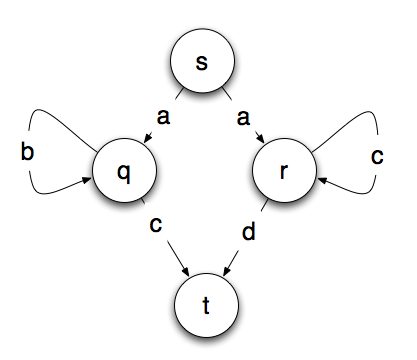
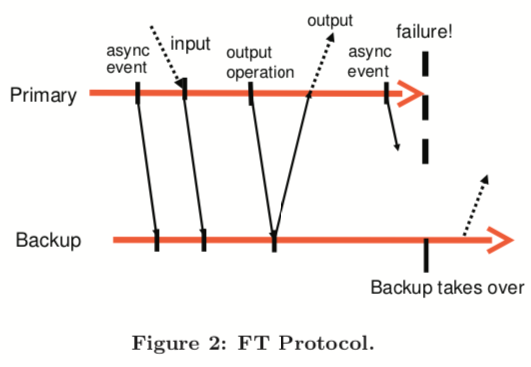
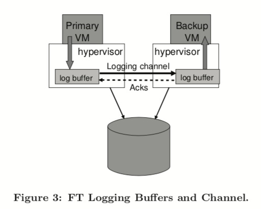
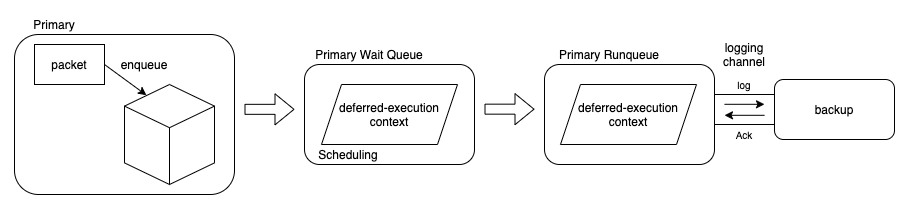

# L4: Primary-Backup Replication

# 3줄 요약

- 논문의 디자인은 `VMware deterministic replay`를 사용해 또 다른 host에 있는 backup VM을 통해 primary VM의 execution을 복제하는 데 기반을 둔다. 만약 primary를 수행하는 서버가 실패한다면, backup은 어떤 로스 없이 즉시 이를 이어 받아 primary가 된다.
- replay를 위해 primary와 backup은 로그를 주고 받는다. 이때 logging bandwidth가 대부분 매우 작기 때문에 primary와 backup이 꽤 먼 거리에 떨어져 있는 것도 가능하다. 그래서 VMware FT는 해당 지역의 전부가 실패하는 재앙도 잘 막을 수 있다.
- VMware FT는 자동적으로 실패 후에 redundancy를 복구한다. 즉, 로컬 클러스터내에서 적절한 서버를 찾아서 그 서버에 새로운 backup VM을 만든다.

# 1. INTRODUCTION

- fault-tolerant servers를 구현하기 위한 흔한 방법은 primary/backup approach 이다. backup 서버는 primary 서버가 실패했을 때 항상 넘겨받아 primary가 될 수 있다. 이렇게 하기 위해서는 primary 서버와 항상 거의 비슷한 상태를 유지해야 한다.
- bandwidth를 덜 쓰는 방법으로는 `state-machine approach`가 있다. 아이디어는 서버가 같은 상태에서 시작하고 같은 순서로 같은 인풋 리퀘스트를 받아서 계속 싱크를 맞추는 `deterministic state machine`으로 생각하는 것이다.
- 이때 coordination이 필요하다. coordination을 physical server에 적용하는 건 어렵다. 하지만 VM에서는 하이퍼바이저가 VM의 execution에 대한 컨트롤을 모두 가지기 때문에 primary VM에서 이루어지는 non-deterministic operations(예를 들면 시간 읽기나 인터럽트 전달 같은 거)에 대한 모든 필요한 정보를 알 수 있다. 그리고 이를 backup에서 올바르게 replay 할 수 있다.
- 기반 기술은 deterministic replay이다. primary의 execution을 기록하고 backup에서 동일하게 실행하는 것이다. 하지만 여기다가 추가적인 protocol들과 기능을 추가했다. 그리고 hardware fault tolerance를 제공하기 위해 실패 후에도 새로운 backup VM이 시작해서 redundancy를 자동적으로 복구한다.

---

*`state-machine`: 유한한 수의 state로 구성돼있다. 현재 상태와 주어진 인풋에 따라 머신은 state를 바꾸고 아웃풋을 만들어낸다.



*`deterministic` : 같은 입력이 들어오면 똑같은 결과가 나온다.


# 2. BASIC FT DESIGN


- 위의 그림은 fault-tolerant VMs를 위한 기본적인 setup을 보여준다.
- backup VM은 primary VM과 다른 physical 서버에서 실행하고 계속 싱크를 맞추면서 primary VM과 동일하게 수행한다. (약간 지연은 있다)
- 이때 두 VM은 `virtual lockstep`에 있다고 지칭한다. VM들을 위한 virtual disk들은 shared storage에 있어 두 VM에서 접근할 수 있다.
- primary VM만 네트워크 상에 존재하기 때문에 모든 네트워크 인풋은 여기로 오고 모든 다른 인풋도 마찬가지로 primary VM 한테만 간다. 그리고 primary VM이 받는 모든 input은 `logging channel`이라고 불리는 network connection을 통해 backup VM으로 보내진다. primary에서 읽은 결과를 해당 채널을 통해 backup으로 보낸다.
- backup VM이 만들어낸 결과는 하이퍼바이저가 버리고 primary가 실제로 client에게 보내지는 아웃풋을 만들어낸다.

## 2.1 Deterministic Replay Implementation

- 만약 두 deterministic state machine이 같은 초기 상태에서 시작하고 정확히 같은 인풋들을 같은 순서로 제공받는다면 결국 같은 같은 시퀀스의 state들을 겪을 거고 같은 아웃풋들을 만들게 된다.
    - 적절한 비유

        

- VM은 네트워크 패킷, 디스크 리드, 디바이스 인풋을 포함한 여러 인풋을 가진다. 또한 인터럽트나 프로세스의 클록 사이클을 읽는 등 non-deterministic한 것들도 있다.


멀티코어는 논문에서 가정하지 않는다.

- 이 때문에 execution을 복제하는 것에 다음과 같은 챌린지가 생긴다.
    1. backup의 deterministic execution을 보장하는데 필요한 모든 인풋과 non-determinism을 올바르게 파악하는 것
    2. backup에 인풋들과 non-determinism을 올바르게 적용하는 것
    3. 이런 방식으로 한다고 퍼포먼스를 떨어뜨리지 않는 것
- Deterministic replay는 VM의 인풋과 모든 가능한 non-determinism을 stream으로 해서 로그 엔트리로 로그 파일에 기록한다. (file 이라고 해서 disk는 아닌 거 같다 왜냐면 뒤에서 아니라) 따라서 VM execution은 나중에 파일에서 로그 엔트리를 읽어서 정확히 replay 된다. non-determinism 역시 재현될 수 있도록 충분한 정보를 기록해둔다. replay 동안에 특정 event는 같은 시점에 전달된다. epoch 같은 거를 이용하면 비효율적일 수도 있지만 논문에서는 epoch를 안 써서 괜찮다고 한다.

## 2.2 FT Protocol

- 로그들을 disk에 쓰는 대신 logging channel을 통해 backup VM으로 보낸다. 그래서 backup VM은 real time으로 replay를 한다. 하지만 fault tolerance를 보장하기 위해서는 엄격한 FT 프로토콜을 이용해야한다.
- output requirement는 다음과 같다. backup VM이 output requirement를 만족한다면 문제가 없을 것이다.

> 만약 backup VM이 primary가 실패해서 그 역할을 넘겨받는다면 primary가 외부에 보내던 모든 output들과 완전히 일관성있는 방식으로 계속 수행을 해야한다.

- output requirement는 보통 네트워크 패킷인 external output을 딜레이시켜서 보장될 수 있다. backup VM이 적어도 해당 아웃풋 연산 시점까지 replay할 수 있는 정보를 받을 때 까지 딜레이시키면 된다. 단, 이때 한 가지 조건은 backup VM이 아웃풋 연산 이전에 만들어진 모든 로그를 받아야 된다는 것이다.
- 하지만 primary가 아웃풋 연산을 수행하고 바로 failure가 발생했을 때 backup VM은 해당 시점까지 replay를 할 뿐만 아니라 output 연산 이전의 마지막 로그 엔트리에서 primary의 역할을 해야한다. 몇몇 non-deterministic event가 아웃풋 연산을 수행하는데 영향을 줄 수 있다. 이때 output requirement를 강제하는 가장 쉬운 방법은 다음과 같은 output rule을 이용하는 것이다.

> primary VM은 backup VM이 아웃풋에 대한 로그 엔트리를 받고 ack를 보내기전까지 외부에 output을 보내지 않는다.

- output 연산에 대한 ack를 기다렸다가 받고 output을 내보낸다면 최소 backup이 output 연산에 대한 로그를 받았다는 걸 보장할 수 있다.



각각은 primary와 backup의 타임라인을 나타내고 primary → backup은 로그 엔트리들의 transfer를 나타내고 backup → primary는 ack를 나타낸다.


만약 client가 1증가 요청을 보냈고 primary가 증가시킨 후 보내려다가 fail 했다면 backup이 1증가 요청을 그대로 replay한 후 primary가 돼 client에게 11이라는 결과를 보내줄 것이다.

- 만약 backup VM이 모든 로그 엔트리들을 받는다면 해당 아웃풋 포인트까지 primary VM의 state를 정확하게 복제할 수 있을 것이다. 오해하지 말아야할 것은 primary VM 자체가 멈춰야한다는 것은 아니고 그저 아웃풋을 보내는 것을 딜레이한다는 것이다. 그 외에 아웃풋 패킷이 중복되거나 드롭되는 문제는 네트워크 단에서 해결을 해주므로 문제가 되지 않는다.

## **2.3 Detecting and Responding to Failure**

- primary와 backup VM은 다른 VM이 실패한 것 같다면 빠르게 반응해야한다. 이때 backup VM이 실패하면 외부에 지장없이 교체만하면 되지만 primary VM이 실패했을 때 좀 더 복잡하다. backup VM은 마지막 로그 엔트리를 소모할 때까지 replay를 계속 해야한다. 그리고 마지막 로그 엔트리를 소모한 순간에 backup VM은  replaying mode에서 벗어나 새로운 primary VM으로서 외부에 아웃풋을 만들 것이다.
- failure를 탐지하는 방법으로 VMware FT는 fault-tolerant를 수행하는 VM들 간에 UDP 하트비팅을 이용하고 로깅 트래픽을 모니터한다. failure는 만약 하트비팅이나 로깅 트래픽이 특정 타임아웃(몇 초 정도)보다 더 길게 멈춘다면 선언된다.
- 하지만 이러한 failure detection 방법론은 split-brain 문제에 민감하다. 예를 들면 backup 서버가 primary server로부터 하트비트를 받는 것을 멈춘다면 primary가 실제로는 문제가 없음에도 primary가 되려고한다. 이로 인해서 문제가 발생할 수 있다. 따라서 failure가 발견됐을 때 primary나 backup 중 하나만 primary가 되도록 보장해야한다.
- split-brain 문제를 피하기 위해서 VM의 virtual disk를 저장하는 `shared storage`를 사용한다. primary나 backup이 primary가 되길 원할 때 shared storage에 atomic `test-and-set` 연산을 한다. 연산이 성공하면 primary가 될 수 있고 실패한다면 연산을 수행한 VM이 스스로를 멈춘다. shared storage 때문에 문제가 생길 수 있다고 생각할 수 있지만 여기에 접근하지 못한다면 쑬모가 없다. 따라서 이로 인해서 문제가 생기지 않고 split-brain을 해결할 수 있다.

---

*`test-and-set`: 동시성을 제어하기 위한 동기화 명령어 중 하나로서, 하드웨어의 도움을 받아 수행된다.

```c
do {
    while(TestAndSet(&lock))
        ; // do nothing
        // critical section
    lock = false;
        // remainder section
} while(true);
```

# 3. PRACTICAL IMPLEMENTATION OF FT

## 3.1 Starting and Restarting FT VMs

- 추가적인 component들 중에 중요한 것 중 하나는 backup VM을 primary VM과 같은 상태로 시작하는 매커니즘이다. 이때 기존에 존재하는 VMware의 VMotion이라는 것을 변형해 VM을 remote host에 클론하고 logging channel을 셋업한다. 그리고 source VM이 primary로서 logging mode에 들어가도록 만들고 destination VM이 새로운 backup으로서 replay mode에 들어가게 만든다.
- backup VM을 시작하는데 있어 필요한 다른 부분은 어느 서버에서 수행할 지를 고르는 것이다. FT VM들은 shared storage에 접근할 수 있는 클러스터에서 수행된다. 그래서 모든 VM들은 일반적으로 cluster 내의 어느 서버에서라도 수행될 수 있다. 이러한 flexibility가 심지어 하나 이상의 서버가 실패했을 때도 FT redundancy를 복구할 수 있도록 해준다.
- VMware vSphere는 클러스터링 서비스를 구현한다. failure가 발생하고 primary VM이 새로운 backup이 필요할 때 이 서비스를 이용하게 된다. 서비스는 리소스 사용과 다른 제한조건을 바탕으로 backup VM으로 쓸 최적의 서버를 결정한다. 그리고 FT VMotion이 새로운 backup VM을 만들도록 한다.

---

*`VMotion` : VMware에서 제공하는 서비스. VM이 켜져 있는 상태에서도 VM이 위치한 호스트나 스토리지를 혹은 호스토와 스토리지를 동시에 바꿀 수 있도록 해준다. 호스트를 바꾸는 것을 `vSphere vMotion`이라고 한다. 


[https://ma-you-ing.tistory.com/29](https://ma-you-ing.tistory.com/29)

## 3.2 Managing the Logging Channel



- 해당 논문에서는 하이퍼바이저가 primary와 backup에 대한 로깅 엔트리들을 위한 큰 버퍼를 유지하도록 만들었다. primary VM이 수행할 때 로그 엔트리들을 로그 버퍼에 만들어낸다. 그리고 유사하게 backup VM은 자신의 로그 버퍼로부터 로그 엔트리들을 소모한다. primary의 로그 버퍼 컨텐츠는 로깅 채널을 통해 backup의 로그 버퍼로 보내져 읽히게 된다. backup은 로그 엔트리를 읽을 때마다 primary에 ack를 보낸다. 이 ack를 통해 VMware FT는 딜레이된 아웃풋이 언제 보내질 수 있는지 결정한다.
- 문제는 backup이 읽으려는데 로그 버퍼가 비어있거나 primray가 로그를 쓰려는데 가득 찼을 때 발생한다. 하지만 backup은 외부와 연결돼있는 게 아니므로 큰 문제가 되지 않지만, primary의 경우 VM의 clients에게 영향을 줄 수 있다. 왜냐하면 로그 버퍼에 자리가 있을 때 까지 기다릴 동안 완전히 VM이 멈추게 되고 반응을 못 하게 되기 때문이다. 따라서 구현에서 고려한 것은 primary의 로그 버퍼가 가득 찰 가능성을 최소화시키는 것이다.
- 따라서 여기서는 backup VM이 primary VM에 너무 뒤처져 로그 버퍼가 가득 차는 것을 방지하는 추가적인 메카니즘을 구현했다. 로그 엔트리를 보내고 ack하는 프로토콜에서 real-time execution 지연( 보통 100 ms 이하)을 결정하기 위한 추가적인 정보를 보낸다. 만약 backup VM이 1초 이상의 execution 지연을 가지고 있다면, VMware FT는 스케줄러에게 약간 더 작은 양의 CPU를 primary VM에 할당해 속도를 낮추도록 만든다. slow feedback loop를 이용해 만약 backup VM이 계속 뒤처진다면 점점 primary의 CPU limit을 줄여나가고 어느 정도 따라잡는다면 점점 늘려나간다.

    *`slow feedback loop`

    

## 3.3 Operation on FT VMs

- 또 다른 실질적인 문제는 primary VM에 적용되는 다양한 컨트롤 연산들을 다루는 것이다. 컨트롤 연산이라고 하면 예를 들어 primary의 CPU share가 증가하면 backup에도 적용돼야한다. 이러한 종류의 연산들은 backup에 적절한 연산을 주기위해 primary에서 backup으로 logging channel을 통해 보내진다. 예외적으로 VMotion는 서로 영향을 끼치지 않는다.
- 일반적인 VMotion은 final switchover가 발생할 때 모든 diskIOs가 중단돼야 한다. primary는 단순히 physical IOs가 끝날 때까지 기다리면 되지만, backup은 replay 때문에 쉽지 않다. 그래서 이 문제를 해결하기 위한 한 가지 방법은 backup이 final switchover에 도달했을 때 logging channel을 통해 primary가 모든 자신의 IOs를 중단하는 것을 요청하는 것이다. 그러면 primary의 중단 연산의 수행을 replay하기 때문에 backup의 IOs도 자연스럽게 중단될 것이다.

## 3.4 Implementation Issues for Disk IOs

- 먼저 disk 연산들이 non-blocking 해서 병렬적으로 수행될 수 있다면, 같은 disk location에 동시에 접근하는 연산은 non-determinism을 가져올 수 있다. 논문에서 disk IO를 구현하는 방법은 VM 메모리에 direct DMA(Direct Memory Access)로 접근하는 것이다. (uses DMA directly) 이에 대한 솔루션은 그런 IO race들을 제너럴하게 탐지하고 primary와 backup에서 같은 방식으로 sequential 하게 수행되도록 강제하는 것이다.
    - `kernel memory mapping` : 메모리는 가상 메모리 공간과 물리 메모리 공간으로 나뉜다. 프로세스마다 가상 4GB 메모리를 가진다. 이때 가상 4GB 메모리 중 상단 1GB는 커널 스페이스로 나머지 3GB는 유저 공간으로 한다.

        

        

        

        - 물리 메모리의 특정 부분(`LowMem`)은 가상 주소에서 `PAGE_OFFSET`(보통 3GB)을 빼서 구할 수 있다.

    

    [http://jake.dothome.co.kr/dma-1/](http://jake.dothome.co.kr/dma-1/)

    

    [http://jake.dothome.co.kr/dma-1/](http://jake.dothome.co.kr/dma-1/)

    - 두번째로는 disk 연산이 VM 내의 app이나 OS에 의한 메모리 접근과 racing을 할 수 있는 것이다. disk 연산이 DMA를 통해 VM의 메모리에 직접 접근하기 때문에 그럴 수 있다. 한 가지 솔루션은 대상 page들에 임시로 page protection을 거는 것인데 이는 비싼 연산이다.
    - 그래서 대신 `bounce buffers`를 쓰는 것을 선택했다. `bounce buffer`는 disk 연산에의해 접근되는 메모리와 같은 사이즈를 가지는 임시 buffer이다. disk 읽기 연산은 bounce buffer에서 지정된 데이터를 읽는 것으로 변경된다. 그리고 data는 IO completion이 전달될 때만 guest memory로 카피된다. bounce buffer를 쓰면 disk 연산 속도를 늦출 수 있지만 그렇게 눈에 띄게 낮추지는 않는다.
    - `ZONE_DMA`

        

        [http://jake.dothome.co.kr/zone-types/](http://jake.dothome.co.kr/zone-types/)

    

    [http://jake.dothome.co.kr/dma-1/](http://jake.dothome.co.kr/dma-1/)

    - 세번째로는 failure가 발생했을 때 primary에서 완료되지 않은 disk IOs와 관련된 몇몇 이슈가 있다. backup에서 새로 primary가 됐을 때 disk IOs가 이슈됐는지 혹은 성공적으로 완료됐는지 알 수 없다. 따라서 이로인해 문제가 발생할 수 있다.
    - 그래서 backup이 primary가 되는 과정 동안 pending IOs를 재이슈한다. 이전에 모든 race를 제거하고 모든 IOs는 어떤 메모리와 disk 블록이 접근될 지 명시하기 때문에, 이런 disk 연산들은 이미 성공적으로 완료됐더라도 재이슈될 수 있다. 즉, 다시 수행되도 문제가 없다.

## 3.5 Implementation Issues for Network IO

- VM의 네트워크 디바이스의 상태를 비동기로 업데이트를 하면 네트워트 성능을 최적화할 수 있지만 non-determinism을 야기한다. 따라서 FT에서 네트워킹 emulation 코드는 비동기 네트워크 최적화를 disable 한다. 비동기로 수행되던 코드는 하이퍼바이저를 통하도록 수정했다. 이로 인해 네트워크 성능에 대한 챌린지가 있어 다음과 같이 해결했다.
- 첫번째로 하이퍼바이저를 통하는 VM traps와 interrupts를 줄이기 위해 clustering optimizations를 구현했다. VM이 충분한 bit rate로 data를 스트리밍할 때, 하이퍼바이저는 패킷 그룹당 하나의 transmit을 할 수 있다. 하이퍼바이저는 패킷 그룹에 대해서만 인터럽트를 걸기 때문에 들어오는 패킷에 대한 인터럽트 수를 줄일 수 있다.
- 두번째는 전송된 패킷에 대한 딜레이를 줄이는 것이다. transmit 딜레이를 줄이는 핵심은 backup에 로그 메세지를 보내고 ack를 받는데 필요한 시간을 줄이는 것이다. 주요한 최적화는 이 과정을 어떤 쓰레드 context switch 없이 진행하는 것이다.
- VMware vSphere 하이퍼바이저는 리눅스의 tasklet과 비슷한 `deferred-execution context` 라고 불리는 함수들이 TCP data를 받을 때마다 TCP stack에 등록될 수 있도록 한다. 이로 인해 backup에서 빠르게 들어오는 로그 메세지를 처리할 수 있고 primary가 받는 어떤 ack도 쓰레드 context switch 없이 가능하다. 게다가 primary가 전송될 패킷을 enqueue할 때 flush를 하기 위해 `deferred-execution context`를 스케줄링 해서 관련된 아웃풋 로그 엔트리가 즉시 flush 되도록 했다.



---

*`interrupt & tasklet`: 인터럽트는 CPU에게 말을 거는 것. 예를 들면 키보드 입력이나 현재 프로세스 수행시간을 재는 것 등. 현재 수행되는 프로세스에 얹혀서 수행되기 때문에 수행 도중 컨텍스트 스위칭이 일어나면 안 됨. 따라서 너무 오래 수행되면 안 됨. 이때 당장 급하지 않고 나중에 수행될 수 있는 것을 뒤로 미룰 수 있음. 이런 것 중 하나가 tasklet. 스케줄링해서 등록하면 처리할 수 있는 CPU가 이를 받아서 처리함.

# 4. DESIGN ALTERNATIVES

## **4.1 Shared vs. Non-shared Disk**

- shared disk는 primary와 backup에게 external하게 생각된다. 즉 외부 세계와의 커뮤니케이션이다. 따라서 오직 primary만 disk에 실제로 쓸 수 있고 ack를 받을 때까지 딜레이돼야한다.
- 대안적인 디자인은 non-shared virtual disks를 가지는 것이다. 이 디자인에서는 backup이 자신의 virtual disks에 모든 disk writes를 한다. 그렇게 함으로써 자연스럽게 primary의 virtual disks의 내용과 싱크를 맞추게 된다. virtual disks는 각각의 VM의 internal state로 생각된다. 따라서 primary가 disk write를 딜레이 할 필요없다. 이런 디자인은 primary와 backup이 shared storage에 접근할 수 없을 때 유용하다.


- 한 가지 단점은 explicit하게 virtual disks에 대해서 싱크를 맞춰야한다는 것이다. 게다가 failure 후에는 disks의 싱크가 맞지 않아, backup이 failure 후에 다시 시작했을 때 explicit 하게 싱크를 다시 맞춰야 한다. 즉, FT VMotion은 primary와 backup의 running state의 싱크를 맞춰야할 뿐만 아니라 disk state에 대한 싱크도 맞춰야한다.
- non-shared에서는 split-brain 상황에서 shared storage를 쓸 수 없기 때문에 두 서버가 통신할 수 있는 third-party server를 이용해야한다.

## 4.2 Executing Disk Reads on the Backup VM

- default 디자인에서는 shared이든 non-shared이든 backup이 절대 자신의 virtual disk에서 read를 하지 않는다. disk read는 인풋으로 생각되기 때문에 logging channel을 통해 disk read의 결과들을 backup에 보내는 게 자연스럽다.
- 대안적인 디자인은 backup이 disk reads를 하도록 만드는 것이다. 그래서 disk read data를 로깅할 필요가 없다. 이러한 접근은 logging channel에 대한 트래픽을 많이 감소시킬 수 있다. 하지만 많은 미묘함(subtlety)가 있다.
- backup이 primary에서는 이미 완료된 disk read를 수행하고 물리적으로 완료되지 않았다면 기다려야 하기 때문에 backup의 execution이 느려진다. 또한 disk read 연산이 실패했을 때 추가적인 비용이 발생한다. disk read가 실패하면 primary와 backup의 메모리 내 데이터가 달라지기 때문이다. 마지막으로는 primary의 disk write(output)가 backup이 disk read를 하고 ack할 때까지 딜레이된다.

# ~~5. PERFORMANCE EVALUATION~~

# ~~6. RELATED WORK~~

# 한계

- deterministic replay를 통해 fault tolerance를 구현하는 트레이오프 중 하나는 현재 uni-processor VM에 대해서만 효율적으로 구현될 수 있다는 것이다.

---

# 강의 질문

Q. primary가 clinet의 요청만 받아서 보내면 프로세서마다 다른 정보는 어떻게 처리?

- 이것또한 primary가 backup에 보내서 backup이 fake answer를 하게 한다. (ex. 현재시간, 프로세서 ID)

Q. backup이 앞서면 어떡하냐?

- buffer에 있을 때만 수행하기 때문에 앞설 일이 없다.

Q. 로깅 채널 충분히 빠른가?

- 대부분 클라이언트 패킷 복사라서 빠를 것이다. 약간의 인터럽트.

Q. 아웃풋 룰 쓰지말고 그냥 프라이머리 메모리 쓰면 안 되냐?

- 안 된다. 프라이머리가 어떤 이유로 안 되면 통째로 사라지고 backup은 전혀 모르게 된다.

Q. 프라이머리와 백업이 보내는 패킷 같냐?

- 다른 피지컬 머신이기 때문에 완전히 같은 수는 없지만 거의 같다.

Q. test-and-set이 실패하면 어떻게 되냐?

- test-and-set 자체가 이미 replication 서버일 것이다. 실패할 일 없을 것이다.
