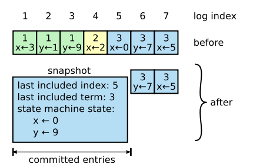

# 1. Introduction

**합의(consensus) 알고리즘**

- 큰 규모의 시스템에서, 일부가 다운되어도 시스템 전체의 일관성은 유지함으로써 **시스템의 신뢰성을 보장하기 위한 알고리즘**

Raft가 만들어지기 이전엔 "Paxos" 라는 합의 알고리즘이 대세였으나 아래의 단점이 존재

- 이해하기 너무 어려움
- 실제로 활용하기 너무 복잡함

좋은 알고리즘이 있다고 해도, 사용자가 이해하지 못하고 실제 개발에 적용하지 못한다면 소용이 없으므로, **understand-ability**에 초점을 두고, 성능 및 정확성까지 놓치지 않는 알고리즘을 개발하게 됨

→ Raft가 만들어지게 됨

Raft는 Understand-ability를 위해 2가지 기법을 사용

- **Decomposition**

    알고리즘을 leader election / log replication / safety 등의 분야로 세분화

- **State Space Reduction**

    비결정론적(nondeterminism) 알고리즘에 의해 발생할 수 있는 case들을 최소화

Raft는 여타 합의 알고리즘에 비해 아래의 매우 참신한 요소들을 도입함

- **Strong leader**

    모든 log entry는 leader → follower 방향으로만 전달됨

- **Leader election**

    "randomized timer"를 사용하여 split vote 상황을 최소화

- **Membership changes**

    "joint consensus" 설정을 사용하여 config changes 상황에서의 safety를 보장

# 2. Replicated state machines

1. **Client** 집합(별개)은 **CM(Consensus Module)**에게 요청(list of commands)을 보냄
2. CM은 Client의 요청을 **본인의 Log에 저장**
    - 💥 **Log는 list of commands, Entry는 a command** 💥
3. CM은 다른 서버의 CM과 통신하여 **Log를 다른 서버로 replication (replicated log)**
4. **제대로 replication이 완료되면** 각 서버의 **SM(State Machine)은 Log에 적힌 command들을 순차적으로 처리**하고 **결과를 Client에게 반환**

하지만, 위의 기능이 제대로 동작하지 못하는 상황이 발생할 수 있음

- 만약 요청을 받은 CM이 crash를 발생시킨다면?
- 만약 모든 서버의 Log가 뒤죽박죽 꼬이게 된다면?

→ 합의 알고리즘이 필요

합의 알고리즘은 **RSM(replicated state machines)** 구조에서의 신뢰성을 보장하기 위해 사용됨

- RSM을 구성하는 **모든 서버들이 동일한 연산(Log)을 하고, 동일한 상태(State)에 있음을 보장**
- 일부 서버에 문제가 있더라도 availability 보장**(fault-tolerance)**
- 어떠한 상황에서도 client의 요청에 대해 정확한 응답을 보장(**safety**)

# ~~3. What's wrong with Paxos?~~

섹션1의 내용 중 Paxos의 단점에 대해 재언급하는 부분. 스킵

# ~~4. Designing for understandability~~

섹션1의 내용 중 Understandbility를 위해 사용한 2가지 기법에 대한 재언급하는 부분. 스킵

# 5. The Raft consensus algorithm

Raft의 합의(consensus)는 **leader의 선출**로부터 시작됨

leader는 replicated log에 대한 모든 권한을 독점적으로 가짐

leader는 client로부터 log entry를 받고, 이를 **다른 서버들에게 replication 함**

제대로 replication이 됐다면, leader는 **서버들에게 해당 entry를 실행해도 좋음을 알림**

만약 leader의 상태에 문제가 생기면, 다른 서버들 중 새로운 leader가 선출됨

Raft는 아래의 5가지 원칙을 기본으로 설계되었음 **(파트5를 다 마치고 다시 돌아옴)**

- **Election Safety**

    한번의 term에 최대 1개의 leader만이 선출될 수 있음

- **Leader Append-Only**

    leader는 절대 자신의 log를 덮어쓰거나 삭제하지 않음. 오로지 new entry를 추가하기만 함

- **Log Matching**

    만약 서로 다른 두 서버의 Log가 동일한 index와 term을 가진 entry를 가지고 있다면, 해당 index 이전의 모든 entry는 동일함

- **Leader Completeness**

    만약 특정 entry가 특정 term에 committed 됐다면, 해당 term 이후의 leader는 모두 해당 entry를 반드시 포함해야 함

- **State Machine Safety**

    만약 특정 서버가 특정 index의 log entry를 실행시켰을 경우, 다른 서버들은 해당 log entry를 다른 index에서 실행하지 않음이 보장됨

## 5.1 Raft basics

각각의 서버는 leader, follower, candidate의 3가지 상태 중 하나를 반드시 가짐

- **leader**: client의 모든 요청을 담당 (모든 요청은 leader로 redirect)
- **follower**: leader의 요청에 응답만을 함
- **candidate**: 새로운 leader의 선출이 필요하다고 판단할 경우, follower는 candidate로 전환

일반적인 상태라면, **1개의 leader와 n-1개의 follower** 로 구성

모든 서버는 follower에서 시작하게 됨

정해진 시간 안에 leader의 연락이 없으면(timeout), follower는 candidate로 전환하고 election  시작

- 자신보다 term이 낮지 않은 새로운 leader를 발견하면 (election 패배) follower로 전환
- timeout동안 leader가 선출되지 않으면 candidate를 유지하고 election 재시작
- 과반수 이상의 동의를 받을 경우 leader로 전환

leader의 경우, network down상태에서 다른 follower가 leader가 된 뒤, 통신이 회복된다면 새로운 term의 leader를 발견하므로 바로 follower로 전환

💥 Raft는 **term**이라는 단위로 구성됨 💥

각각의 term은 새로운 election으로 시작되고, 다음 election이 시작될 때까지 지속됨

여러 candidate가 동시에 발생하여 leader를 정하지 못하고 timeout이 발생하는 **split vote** 상황이 올 경우, 해당 term은 그냥 끝나고 새로운 term이 바로 시작됨

각 서버들은 네트워크 등의 문제로 term의 전환을 받아들이는 시기가 다를 수 있음

(늦게 확인하거나, 아예 확인하지 못하거나)

이럴 경우를 위해 서버는 서로 통신할때 각자의 **current term을 교환**하고, 자신보다 높은 term을 발견하면 해당 term으로 **current term을 업데이트**함

이는 candidate와 leader도 마찬가지이며, 자신보다 높은 term의 서버를 발견하면 **follower로 전환**함

자신보다 **낮은 term의 서버로부터 온 요청은 모두 거절**함

term은 Raft에서 일종의 **logical clock을 담당**하여, log의 노후(obsolete) 여부를 알게 해줌

Raft는 서버들 간 통신을 위해 **RPC를 사용**하는데, 총 3가지 종류가 있음

- **RequestVote(RV)**: candidate가 election을 열 때 사용
- **AppendEntries(AE)**: leader가 log entry를 replication할 때 혹은 heartbeat를 체크할 때 사용
- **InstallSnapshot(IS)**: leader가 snapshot을 replication할 때 사용

기본적으로, RPC에 대한 응답을 받지 못하면 **받을때까지 retry를 진행 (indefinitely)**

## 5.2 Leader election

leader는 주기적으로 (비어있는) AE call을 통해 **heartbeat를 체크**함

follower의 입장에서, **"election timeout"**에 정해진 시간 이내에 leader로부터 어떠한 call도 받지 못하면, leader에 문제가 생겼다고 판단하고 election을 진행함

election을 시작할때, **follower는 본인의 상태를 candidate로 전환하고, current term을 증가**시킴

모두에게 RV call을 보낸 뒤, 스스로에게 한표를 행사

아래의 3가지 상황 중 하나가 발생하기 전까지 계속 candidate 상태로 대기

1. **자신이 과반수의 투표를 받아 leader로 선출**
    - 과반수의 투표를 받아야만 leader가 될 수 있음
    - Majority rule은 단 하나의 leader만 생기는 것을 보장하기 위한 규칙
2. **다른 candidate이 과반수의 투표를 받아 leader로 선출되고, AE call을 보냄**
    - leader의 term이 자신보다 같거나 크다면, leader로 인정하고 follower로 전환
    - 그렇지 않다면, AE call을 거절하고 candidate 상태 유지
3. **candidate가 많아 leader를 선출하지 못하고 election timeout이 또 끝남**
    - split vote로 timeout이 발생하면, term을 올리고 다시 election 진행

split vote는 Raft의 leader election 특성상 **무한대로 발생할 수 있음**

이를 막기 위해 💥 **randomized election timeout** 💥 이 사용됨.

- 각 candidate들의 election timeout을 정해진 범위 안에서 **임의로 다르게 설정**함(150-300ms)

따라서, leader에 문제가 생기더라도, 모든 follower들은 이를 각각 다른 시간에 인지하게 되어, 동시에 여러 candidate가 발생하는 경우를 막아줌

이는 **비결정론적 알고리즘이지만,** 결국 state case를 줄여주기 때문에, understand-ability 2원칙인 **"State space reduction"에 부합**하여 도입

초기엔 randomized election 대신 ranking system을 도입하려 했으나 해당 형태로 발전하게 됨

## 5.3 Log replication

leader가 선정되면, client의 요청(command)을 받기 시작함

leader는 해당 요청을 **자신의 log에 하나의 entry로 추가**하면서 **AppendEntries call**을 통해 다른 서버의 log에도 **해당 entry를 replication**함 **(not execution)**

문제가 있는 follower에 대해서는 지속적으로 retry 진행함

**과반수의 서버에 entry가 안전하게 replication된 것이 확인**되면, leader는 **해당 entry를 "commit"**하고 모든 서버는 해당 entry를 실행함

leader는 변경된 state를 client에게 반환함

각각의 entry는 log 내에서 자신의 **index와 term number, command** 를 가지고 있음

leader는 entry가 **과반수 이상의 서버의 log에 복제**됐다면, **"committed entry"**로 표시함

follower들은 **AE call에 포함된 committed entry 정보를 보고, 해당되는 entry는 전부 실행**함

Raft는 각 서버들이 가진 log의 일관성(consistency)을 위해 아래의 원칙을 보장

**Log Matching Property (LMP)**

- 서로 다른 log의 두 entry가 같은 index, term을 갖는다면, 두 entry는 동일한 command를 포함함
    - leader는 특정 term에 특정 index에 단 하나만의 entry를 추가할 수 있음
    - entry는 log 내에서 position을 변화시키지 않음
    - (이를 위해 leader는 자신의 committed entry를 follower에게 덮어씌움)
- 서로 다른 log의 두 entry가 같은 index, term을 갖는다면, 앞선 entry까지 두 log는 모두 동일함
    - leader는 AE call을 보낼 때, new entry 직전 entry의 index, term 정보를 함께 보냄 **(consistency check)**
    - follower가 해당 entry를 자신의 log에서 찾지 못하면 new entry를 거부함

LMP 원칙은 **모든 log가 비어있을 때**, **새로운 entry가 추가될 때** 모두 보장되므로, 항상 보장되는 것이 증명됨

일반적인 상황이라면, AE call의 consistency check는 실패하지 않음

하지만 **지속적인 leader crash는 문제를 일으킬 수 있음**

(a-b) : leader보다 적은 entry를 가짐

(c-d) : leader보다 많은(extra) entry를 가짐

위의 문제는 주로 **leader가 new entry를 제대로 replication하지 못하였기에 발생**함

(f) → (e) → (a) → (c) → (d) 순으로 문제가 발생

위와 같은 문제의 상황에서 일관성을 유지하기 위해, **leader는 자신의 log를 follower에 덮어씌움**

leader는 consistency check를 통해 follower의 log를 보고, **일치하는 최신 entry 이후는 전부 삭제**함

leader는 follower 별로 "**nextIndex"** 값을 저장하여, 각 follower에게 어떤 entry를 보낼지를 기록함

leader가 교체되는 경우, nextIndex는 모두 초기화되며, **consistency check를 지속적으로 보내어 nextIndex 값을 조정**함

leader는 **Leader Append Only 원칙에 따라 절대 자신의 log를 수정하지 않음**

## 5.4 Safety

하지만, 위에서 언급된 동작들이 아무런 제한없이 적용된다면, 문제가 생길 수 있음.

예로, 위의 상황에서, 특정 follower가 오랫동안 down되어 committed entry를 하나도 받지 못하다가, 갑자기 leader가 된다면 앞선 committed entry들은 **전부 잘못된 새 leader의 entry로 덮어씌워질 것**임

committed entry는 **이미 각 서버의 state machine이 실행한 entry**로, 이를 다른 entry로 덮어씌우는 일은 발생해선 안됨

위와 같은 상황을 막고자, **Raft는 몇몇 restriction을 활용함**

### 5.4.1 Election restriction

candidate가 leader가 되기 위해선 RV call을 보내고 과반수의 투표를 얻어야 함

이때, candidate는 **RV call에 자신의 log의 committed entry 정보를 포함**해야 함

그리고 해당 committed entry 정보가 follower들의 **committed entry보다 최신**일 경우만, follower들은 해당 candidate에 투표함

잘못된 candidate의 경우, committed log가 최신이 아닐 것이며, committed log는 과반수 이상의 서버에 replication되는 것이 보장됨으로, **candidate는 절대 과반수 이상의 표를 얻을 수 없게 됨**

### 5.4.2 Committing entries from previous terms

leader는 **자신의 term에 발생한 entry에 대해서 commit을 할 수 있음** 

(과반수 서버에 replication 완료)

일부 서버에 replication만 하고, commit을 하지 못한 상황에서 leader가 죽게되면, **해당 entry는 commit되지 못한 상태로 남아있게 됨**

새로운 term에서 새로운 leader가 선출됨

이 leader는 이전 term의 commit되지 않은 entry가 있음을 인지하고 이를 다른 서버에 replication

이때, **replication은 하지만 과반수가 넘었더라도, 이전 term의 entry를 직접 commit하는 것은 제한**

*(why? 개인적인 의견 - 토론해봐요)*

만약 (c)에서 term 4의 leader가 entry 2를 commit 했다면, S1이 죽었을 경우, S2, S3만이 leader가 될 수 있음

이전 term의 leader가 복사해둔 replication을 현재 leader가 직접 commit하는 것은 자신이 발생시키지 않은 정보를 통해 추후 leader 선출 가능한 서버의 경우의 수를 줄이는 것.

## 5.5 Follower and candidate crashes

follower 혹은 candidate에게 문제가 생길 경우, 이들에게 가는 **AE, RV call은 모두 실패**하게 됨

이때 해결책은 간단하게도, **계속해서 retry**를 하는 것임

**Raft의 RPC call은 idempotent**하기 때문에 follower 혹은 candidate가 RPC call을 아예 받지 못하였든, 받고 처리하였으나 응답을 못하였든 상관없이 실행할 수 있음

## 5.6 Timing and availability

client에게 제 시간에 응답을 주기 위해, **election timeout과 같은 timing을 조절하는 것은 중요함**

예를 들어, leader가 재시작하는 시간보다 서버 하나에 log replication 하는 시간이 더 길다면, 자신의 차례를 기다리는 다른 서버 입장에서는 leader가 down된 것인지, replication중인지 알 수 없음

따라서, 위와 같은 timing 설정이 대체로 요구됨

- **broadcastTime** : leader가 모든 서버에게 RPC call을 보내는데 평균적으로 걸리는 시간
- **MTBF(Mean Time Between Failure)** : 서버가 죽었다가 살아나는데 평균적으로 걸리는 시간

즉, election timeout은 leader가 서버들에게 AE call 및 heartbeat를 보내는 시간보다는 당연히 길어야 하며, MTBF보다는 작아야 실질적으로 의미가 생김

일반적으로 0.5 ~ 20ms / 10 ~ 500ms 등이 선호되며, **당연히 환경마다 다르게 설정돼야 함**

# 6. Cluster membership changes

지금까지는, 각 서버들의 configuration이 고정됐다고 가정함

하지만, **서버 교체 및 추가**와 같이 실제 상황에서 설정에 변화가 생기는 것은 막을 수 없음

이때, 전부 다 끄고 설정을 다 바꾸고 전부 다 켜면 편하겠지만, 당연히 안됨

Raft는 **config change 상황에 효율적으로 대처**하기 위한 내용을 포함하고 있음

클러스터를 구성하는 각 서버들마다, **config는 미세하게 다른 시점에 적용될 수 밖에 없음**

이는 Cluster(old) / Cluster(new) 로의 split을 초래하며 잠깐동안 **2개의 leader를 가지는 문제**가 발생

이를 피하고자, **2 phase에 걸쳐 config change**를 진행

Raft에서 **cluster config는 replicated log의 특수한 entry에 저장**됨

해당 entry는 commit되지 않고 **replication되는 순간부터 효력을 발휘**함

config change의 상황에서, leader는 **"joint consensus" config entry**를 생성하고, 전체 서버에 전달

클러스터의 서버들은 처음에 old config entry를 갖다가, 하나둘씩 joint consensus config entry를 전달받게 됨 (old config / joint consensus config의 공존)

과반수 이상의 서버가 joint consensus config entry를 전달받아 해당 **entry가 commit되면**, 클러스터는 **joint consensus 상태로 전환**되며, 이때 클러스터는 아래와 같은 방식으로 동작

- new log entry가 들어오면, 모든 서버로 전달
- Cluster(old) / Cluster(new) **각각이 존재함을 인정**
- 클러스터 전체의 합의가 필요한 경우, **old, new 2개 클러스터 모두로부터 과반수를 넘겨야 진행 가능** ( old, new 클러스터 독자적인 의사결정 불가능 )

joint consensus가 commit된 상황에서, **leader는 new config entry를 만들고 모든 서버에 보냄**

과반수 이상의 서버에 new config가 replication됐다면, 이를 commit

**Cluster(old)의 서버들은 더 이상 영향을 주지 못함**

config change에 관해 추가로 논의할 이슈

1. **새로 추가되는 서버**들은 완전히 비어있는 log 를 가짐
    - 따라서, 시스템이 큰 경우, 최신 log를 따라잡는데 오랜 시간이 걸릴 수 있으며, config entry의 수용도 늦어짐
    - 이러한 서버들은 **non-voting member로 간주**하여 의사결정에 참여하지 않고, log만 계속 replication 받을 수 있도록 한 뒤, replication이 끝나면 정상 서버로 수정
2. **current leader가 new config의 대상이 아님**
    - 이 경우, leader는 new config entry를 commit함과 동시에 follower로 전환
    - leader는 new config entry를 commit하는동안, 자신이 포함되지 않은 클러스터를 관리하는 상황이 발생
    - **해당 클러스터의 의사결정에는 leader는 참여하지 않게 함**
3. **new config cluster에 포함되지 않는 서버의 방해**
    - 해당 서버는 새로운 leader로부터 heartbeat를 받지 못하게 되고, RV call을 보내게 됨
    - 이때 leader가 바뀔 수 있음 (term이 높을 경우)
    - 이를 방지하고자, **서버들은 current leader가 분명히 있다고 판단될 경우, RV call을 무시**함
    - current leader로부터 연락을 받은지 일정 시간이 지나기 전에 받는 RV call은 무시하는데, 이는 election timeout이 적용된 정상적인 leader election 상황에는 영향을 주지 않음

# 7. Log compaction

시스템이 오랜 기간 지속될 경우, log는 엄청나게 큰 규모로 쌓이게 됨

이럴 경우, 각종 처리에 오랜 시간이 걸리게 되어 제한이 필요한데, 이때 **snapshotting을 활용**

모든 서버는 **각자 committed entry의 snapshot을 만들고**, 그 이전의 entry 및 snapshot은 모두 삭제

snapshot은 아래의 metadata 등을 포함함

- **last included index / last included term / state machine state**

snapshot은 **각각의 서버에서 직접 생성**하지만, committed log를 갖지 못한 서버 혹은 새로 추가된 서버를 위해 **leader가 snapshot을 보내주는 경우**도 있음

이때 **InstallSnapshot call** 활용됨

물론, 이는 strong leader 기조에 반하긴 하나, 아래의 이유 등으로 적용하게 됨

- 최신 entry 자체는 leader → follower 의 방향으로 전달됨
- 모든 snapshot을 전송하는 것에 대한 **네트워크 손실이 너무 큼**

snapshot은 굉장히 클 수 있기에, **snapshot retention 주기 등을 잘 관리**해야 함

# 8. Client interaction

client는 임의의 서버에게 요청을 보내고, l**eader가 아닌 서버는 leader의 정보를 client에게 전송하면 client는 leader에게 요청을 재전송**

crash가 발생할 경우 지속적으로 retry를 하는데, 이때 leader가 client의 요청을 처리하고 crash가 났는지, 그 이전에 났는지 알 수 없음

이때는 client 입장에서 **요청에 고유한 번호를 부여**하고, leader는 이 번호를 활용하여 자신이 해당 요청을 처리했는지 아닌지를 구별하는 것이 가능

**read-only 작업**의 경우, log에는 아무것도 쓰지 않으면서 처리할 수 있음

하지만, current leader가 응답하는 도중, new leader가 선출된다면, client는 stale data를 받게 됨

**(old leader여도 읽기 자체는 가능)**

이런 경우에 대비하여 아래의 요소들이 도입됨

- leader는 최초 선출되면, 본인이 가진 log 중 어디까지 committed 되었는지 확인이 필요

    이를 위해 term당 최초 1회 **no-op entry를 commit**하게 하여 자신이 가진 log들을 최대한commit할 수 있음

- leader는 read-only 요청을 처리하기 이전에, 자신이 제대로된 leader인지 확인하는 절차를 거침

    과반수의 서버들에게 heartbeat요청을 보내고, 제대로 응답을 받으면 그때 **자신이 leader임을 재확인하고 read-only 요청을 처리**함

# 9. Implementation and evaluation

RAMCloud의 config 정보를 저장하는 replicated state machine에 Raft를 도입하였음

테스트, 주석, 공백 없이 순수하게 2000줄이 넘는 코드이며, 소스코드는 공개되어있음

**understand-ability, correctness, performance 측면에서 다양하게 평가**를 거쳤으며, Paxos에 비해 성능 및 정확성이 떨어지지 않고 **understand-ability는 월등함**이 확인됨

# ~~10. Related work~~

앞에 설명한 요소들을 간략히 다시 설명. 스킵

# 11. Conclusion

Raft는 Paxos같이 너무 어려운 알고리즘이 아니라, understand-ability를 잘 고려하여 만든 알고리즘임

훨씬 쉽게 사용 가능할 것임

# ~~12. Acknowledgement~~

당연히 스킵

# 복습

Raft의 참신한 요소들

- **Strong leader**

    모든 log entry는 leader → follower 방향으로만 전달됨

- **Leader election**

    "randomized timer"를 사용하여 split vote 상황을 최소화

- **Membership changes**

    "joint consensus" 설정을 사용하여 config changes 상황에서의 safety를 보장

Raft의 5원칙

- **Election Safety**

    한번의 term에 최대 1개의 leader만이 선출될 수 있음

- **Leader Append-Only**

    leader는 절대 자신의 log를 덮어쓰거나 삭제하지 않음. 오로지 new entry를 추가하기만 함

- **Log Matching**

    만약 서로 다른 두 서버의 Log가 동일한 index와 term을 가진 entry를 가지고 있다면, 해당 index 이전의 모든 entry는 동일함

- **Leader Completeness**

    만약 특정 entry가 특정 term에 committed 됐다면, 해당 term 이후의 leader는 모두 해당 entry를 반드시 포함해야 함

- **State Machine Safety**

    만약 특정 서버가 특정 index의 log entry를 실행시켰을 경우, 다른 서버들은 해당 log entry를 다른 index에서 실행하지 않음이 보장됨