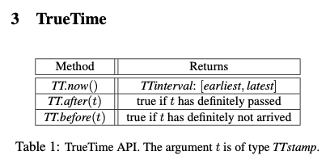

# L13: Spanner

## Spanner

### 등장 배경

2005, 2006년 구글은 아주 큰 규모로 MySQL을 이용하고 있었다. Google의 Adwords는 데이터를 저장하기 위해 MySQL을 사용하는 가장 큰 조직 중 하나였는데 저장을 위해 90+개의 샤드가 이용되었다. 관리 작업 때문에 MySQL 클러스터를 re-shard 해야할 일이 있었다. 그런데 이 작업이 무려 2년이 걸렸다. 구글은 자신들이 매우 빠르게 성장할 것이고 이런 종류의 데이터베이스는 미래에 큰 고통이 될 것이라 생각했기 때문에 Spanner가 등장 하게 되었다.

### Spanner란

Spanner는 완전 관리형 그리고 관계형(semi-관계형) 데이터베이스 서비스로 수평적인 확장을 지원한다. 추상화된 관점에서 보면 Spanner는 전 세계의 데이터 센터에 걸쳐 퍼져있는 Paxos state machine들에 데이터를 샤딩하는 시스템이다. Spanner의 특징으로는 다음과 같은 것들이 있다.

- 수평 확장이 가능하다
- 데이터의 버저닝을 지원한다.
- 글로벌 스케일로 분산되어 있고 Synchronously replicated 된다
  - 복제(replication)은 global availability와 지리적 지역성(geographic locality)를 위해 이용된다. 클라이언트들은 복제본 간에 자동적으로 failover를 한다.
- Externally consistent 한 트랜잭션을 지원한다.
  - 글로벌 스케일로 데이터를 분산하며 externally consistent 한 분산 트랜잭션을 지원하는 첫 시스템이다.

아래는 GCP에서 사용할 데이터베이스를 고를 때 참고할만한 의사결정 나무이다.

이를 통해 보면 Spanner는,

- 데이터가 구조화(structured) 되어 있고
- Workload가 분석 목적이 아니며
- 데이터가 관계형(relational)이고
- 수평 확장의 지원이 필요한 경우 사용하기에 적합한 데이터베이스이다.

#### Semi-relational database

Spanner의 데이터는 스키마가 있는 semi 관계형 테이블에 저장된다. 각 데이터는 버저닝되고 자동적으로 커밋 시간과 타임스탬프가 지정된다. 이전 버전의 데이터에 대해서는 GC(garbage collection) 정책을 지정할 수 있다. 또한 어플리케이션은 이전 타임스탬프에서 데이터를 읽을 수 있다.

Spanner는 또한 범용 트랜잭션과 SQL 기반의 쿼리 언어를 제공한다.

#### 흥미로운 기능들

Spanner는 전 세계에 분산되어 있는 데이터베이스로 여러 가지 흥미로운 기능을 제공한다.

첫 번째로 어플리케이션이 복제에 관한 설정을 *`동적`*으로 제어할 수 있다. 어플리케이션이 어떤 데이터 센터가 데이터를 가지고 있을지 명시할 수 있다. 읽기 지연(read latency)를 위해 유저로부터 데이터가 얼마나 떨어져 있을 수 있는지를 명시할 수 있다. 쓰기 지연(write latency)를 위해 각 복제(replica)가 얼마나 떨어져 있을지를 결정할 수 있다. 또한 durability, availability 그리고 읽기 성능을 위해 얼마 만큼의 복제가 있어야 할지도 설정할 수 있다. 각 데이터 센터 간 균형을 맞추기 위해 데이터는 *`동적`*으로 *`transparent`* 하게 이동한다.

두 번째로 특정 타임 스탬프에서 읽기, 쓰기 그리고 globally-consistent 읽기에 대해 externally consistent를 제공한다. Spanner는 이 기능을 통해 consistent한 작업들을 실행할 수 있다. 예를 들어 consistent backup을 할 수 있고 consistent MapReduce를 실행할 수 있으며 atomic schema update를 할 수 있다. 이러한 기능은 Spanner가 글로벌 수준에서 의미 있는 커밋 타임스탬프를 각 트랜잭션에 부여하기 때문에 가능하다. 각 타임스탬프는 serialization order를 반영한다. 그리고 serialization order는 external consistency(== linearizability)를 만족한다. 이것을 만족하게 하는 핵심적인 요소는 TrueTime API이다.

- linearizability: 트랜잭션 T1이 다른 트랜잭션 T2이 시작되기 전에 커밋 되었다면 T1의 타임스탬프가 T2보다 작다.

### Spanner의 주요 구현 사항

각 Spanner의 배포는 universe라 불린다. Spanner는 데이터를 글로벌하게 관리하기 때문에 몇 개의 universe만 존재한다. (논문 작성 시점 기준) test/playground universe와 development/production universe 그리고 production-only universe라고 불린다.

Spanner는 여러 개의 존(zone)들의 집합으로 구성된다. 각 존은 관리 상의 배포 단위이다. 존은 또한 데이터를 복제할 수 있는 위치들의 모음이기도 하다. 존은 새로운 데이터 센터가 추가되고 빠짐에 따라 운영되고 있는 시스템에서 추가되거나 제거될 수 있다. 존은 또한 물리적 격리(isolation)의 단위이기도 하다. 하나의 데이터 센터 안에 한 개 이상의 존이 있을 수 있다. 예를 들어 다른 어플리케이션의 데이터는 같은 데이터센터라고 하더라도 반드시 다른 서버 군에 파티셔닝 되어야 한다.

- 존은 AWS의 AZ 비슷한 개념인 것 같다. 그런데 하나의 데이터센터에 여러 개의 존이 있을 수 있다고 말하는 걸로 보아 완전히 같은 개념은 아닌 것 같다.

)

위의 그림을 통해 살펴보자. 위의 그림은 하나의 universe의 구성을 나타낸다. 각 존에는 하나의 zonemaster가 있고 수백에서 수천개의 spanserver 들이 있다. Zonemaster는 데이터를 spanserver에게 할당한다. Spanserver는 데이터를 클라이언트에게 실제로 서빙하는 역할을 한다. 각 zone에 있는 location proxy들은 클라이언트가 데이터를 제공하도록 할당 된 spanserver를 찾는 데 사용된다. Universe master와 placement driver는 단일 개체(singleton)이다. Universemaster는 주로 interactive debugging을 위해 모든 존에 대한 상태 정보를 제공하는 콘솔이다. Placement driver는 존 간에 데이터가 이동하는 것을 처리한다. 이 처리는 분 단위로 이루어진다. Placement driver는 주기적으로 spanserver와 통신하며 업데이트 된 복제 제약 조건을 충족하거나 로드 밸런싱을 위해 이동해야 하는 데이터들을 찾는다.

#### Spanserver Software Stack

Spanner는 Bigtable을 베이스로 해서 구현 되었다. 여기서는 Bigtable의 구현위에 어떻게 복제와 분산 트랜잭션이 구현되었는지를 살펴본다.

각 spanserver는 100~1000개의 tablet이라 불리는 데이터 구조에 대한 책임을 갖는다. Tablet은 이런 매핑(`(key: string, timestamp: int64) → string`)의 묶음이다. Spanner는 데이터에 타임스탬프를 할당한다. 이게 단순히 Spanner가 key-value 라기 보다는 멀티 버전 데이터베이스인 이유이다.

Tablet의 상태는 B-tree와 유사한 파일 셋과 write-ahead log에 저장되며 모두 Colossus에 저장된다.

- Colossus는 분산 파일 시스템으로 GFS의 후속 버전이다. 매우 큰 규모의 데이터베이스에서는 매우 고성능의 파일 시스템이 필요하다. Colossus는 BigTable 팀에서 부터 시작되었고 BigTable 또한 Colossus로 부터 구현되었다. 그래서 Spanner 또한 Colossus 를 파일 시스템으로 사용한다.

복제를 지원하기 위해 각 spanserver는 각 태블릿 위에 단일 paxos state machine을 구현한다. 각 state machine는 그것의 메타데이터와 로그를 그에 해당되는 tablet에 저장한다. Spanner의 paxos 구현은 time-based leader lease와 함께 long-lived leader를 지원한다. Lease의 디폴트 값은 10초이다. (~~현재 Spanner의 구현은 모든 paxos의 write를 두 번씩 기록한다. 한 번은 tablet의 log에 기록하고 다른 한 번은 paxos의 로그에 기록한다. 이 구현은 편의를 위한 것으로 차차 해결될 것이다~~). Paxos의 구현은 파이프라이닝 되어 있으므로 네트워크 지연(WAN latencies)가 있을 경우 Spanner의 쓰루풋을 향상시킬 수 있다. 그러나 Paxos에서 write는 순서대로 일어난다.

Paxos state machine은 지속적으로 복제되는 bag of mappings을 구현하기 위해 사용된다. 각 복제의 key-value 매핑 상태는 그에 해당되는 tablet에 저장된다. Write는 반드시 Paxos protocol을 반드시 리더에서 시작해야 한다. Read는 충분히 최신인 복제본에서 상태에 직접 접근한다. Replica의 세트가 Paxos group이다.

- 뒤에서 예를 통해 조금 더 자세히 살펴볼 것

리더인 모든 레플리카에서 각 spanserver는 동시성 제어의 구현을 위해 lock table을 구현한다. lock table는 [two-phase locking](https://itwiki.kr/w/2%EB%8B%A8%EA%B3%84_%EB%A1%9C%ED%82%B9_%EA%B7%9C%EC%95%BD)을 위한 상태를 저장한다: 잠금 상태의 키 범위를 매핑한다. 동기화를 필요로 하는 연산들(예를 들어 transactional한 읽기)는 lock table에서 lock을 얻고 진행한다. 그렇지 않은 경우는 lock table을 bypass 한다.

리더인 모든 레플리카에서 각 spanserver는 분산 트랜잭션을 지원하기 위해 트랜잭션 매니저를 구현한다. 트랜잭션 매니저는 파티션 리더를 구현하기 위해서도 사용된다. 만약 트랜잭션이 한 개의 paxos group 과만 연관 된다면 트랜잭션 매니저를 bypass 할 수 있다. 그러나 만약 트랜잭션이 두 개 이상의 paxos group과 연관 된다면 two phase commit을 조정하기 위해 두 그룹의 리더들은 조정해야 한다. 파티션 그룹 중 하나가 조정자(coordinator)가 된다.

- 뒤에서 예를 통해 조금 더 자세히 살펴볼 것

#### Directories and Placement

Spanner는 bag of key-value mappings 위에 디렉터리(directory)라 불리는, bucketing 추상회된 개념 지원한다. 이것은 공통의 접두어를 갖는 연관된 키들의 집합이다. 디렉터리가 제공되기 때문에 어플리케이션들은 키를 잘 선택해서 데이터의 로컬리티를 제어할 수 있다.

디렉터리는 데이터 배치(data placement)의 단위이다. 각 디렉터리에 있는 모든 데이터는 같은 복제 설정을 갖는다. Paxos group 간에 데이터가 이동할 경우 디렉터리 단위로 데이터가 이동된다. Spanner는 paxos group의 부하를 덜기 위해 디렉터리를 옮길 수 있다. 자주 접근 되는 디렉터리를 같은 paxos group안에 배치하거나 접근자와 가까운 곳에 디렉터리를 배치하는 식이다. 디렉터리는 사용자가 접근하고 있는 동안에도 움직일 수 있다. 

Spanner의 tablet은 row space의 여러 개의 파티션을 캡슐화할 수 있는 컨테이너이다.

Movedir은 Paxos group 간에 데이터를 옮길 수 있는 백그라운드 태스크이다. Movedir은 또한 Paxos group에 replica를 추가하거나 삭제할 때 사용되기도 한다. Movedir은 단일 트랜잭션으로 구현되지 않는데 이는 부피가 큰 데이터 이동 중에 지속적인 읽기 및 쓰기를 차단하지 않기 위함이다. 대신에 movedir은 데이터를 옮기기 시작했다는 사실을 등록하고 데이터는 백그라운드에서 옮긴다. 명목상의 데이터를 제외하고 모든 데이터를 옮기고 난 뒤에 트랜잭션을 이용해서 아토믹하게 명목상의 데이터를 이동하고 두 Paxos 그룹 간의 메타 데이터를 업데이트 한다.

디렉터리는 또한 어플리케이션에서 지리적 복제 속성을 지정할 수 있는 가장 작은 단위이다. Placement specification 언어의 설계는 복제 설정 관리의 책임을 분리한다. 관리자는 두 차원을 컨트롤한다: 레플리카의 수와 타입 그리고 그 레플리카의 지리적 배치를 컨트롤 한다. 그리고 관리자는 두 차원을 조합해 옵션을 만든다(e.g, Notrh Ameriza, replicated 5 ways with 1 witness). 어플리케이션은 데이터베이스에 태깅하거나 각각의 디렉터리에 옵션을 조합하는 것을 통해 어떻게 데이터가 복제될지를 컨트롤한다.

Spanner는 사실 데이터가 너무 크다면 디렉터리를 다시 여러 개의 fragments로 나눈다. Fragments는 여러 개의 서로 다른 paxos group에 의해 서빙될 수 있다.

#### Data Model

Spanner가 제공하는 데이터 모델의 특징은 다음과 같다.

- 스키마화된 semi-relational 테이블, 동기화된 복제
  - 지원 이유: 데이터 모델이 관리하기 쉽다. Bigtable은 eventual consistency 만을 지원한다.
- 쿼리 언어
  - Dremel로 비롯되는 데이터 분석 솔루션에서 알 수 있듯이 쿼리 언어가 주는 장점은 분명하다.
- 범용적인 목적의 트랜잭션
  - 어플리케이션 프로그래머가 항상 트랜잭션 지원의 부족으로 인해 그것을 신경쓰고 코딩하기 보다는 차라리 트랜잭션으로 인해 병목이 발생해 성능상의 문제가 생길 때 그것을 해결하는 게 낫다고 생각한다.

어플리케이션의 데이터 모델은 Spanner 구현에서 지원되는 디렉터리 버킷-키 값 매핑 위에 계층화된다. 어플리케이션은 universe에 하나 이상의 데이터베이스를 만든다. 각 데이터베이스는 숫자의 제한 없이 스키마화된 테이블을 만들 수 있다. 테이블은 관계형 데이터베이스의 테이블과 비슷하게 생겼다. 행(row)이 있고 열(column)이 있고 버저닝된 값이 있다. 쿼리 언어는 SQL과 비슷하게 생겼고 protocol buffer의 필드를 지원하기 위한 확장도 있다.

Spanner의 데이터 모델은 각 행에 이름이 있어야 한다는 점에서 완전히 관계형은 아니다. 더 정확히 말하면 모든 테이블에 하나 이상의 PK 컬럼의 순서를 지정할 수 있는 집합이 있어야 한다. 이러한 요구사항 때문에 Spanner는 여전히 key-value store 처럼 보이는 측면이 있다.

- 데이터 모델의 예

)

모든 Spanner의 데이터베이스는 클라이언트에 의해 하나 이상의 테이블 계층 구조로 분할되어야 한다. 클라이언트는 `INTERLEAVE IN` 을 통해 이것을 선언할 수 있다. 계층의 맨 위에 있는 테이블이 directory table이 된다(이 경우에는 Users). 각 계층 구조에서 디렉터리 테이블의 K key에는 자식 테이블의 K 키에 해당하는 값들이 사전 순으로 같이 놓인다. 이 경우에는 Users(1) 데이터 뒤에 Albums(1, *)가 있고 Users(2) 데이터 뒤에 Albums(2, *) 가 있는 식이다. `ON DELETE CASCADE` 를 통해 부모의 데이터가 지워졌을 때 데이터가 같이 지워지게도 할 수 있다.

이런 식의 테이블 구조가 중요한 이유는 클라이언트가 데이터의 로컬리티를 제어할 수 있기 때문이다. 데이터의 로컬리티는 분산 데이터베이스에 있어 퍼포먼스에 매우 중요하다. 이런 구조가 없다면 Spanner는 데이터 로컬리티에 대해 알기 어려울 것이다.

### TrueTime

#### TrueTime API를 위한 물리적 구성

TrueTime API를 위한 물리 장비이다

Spanner는 여러 데이터센터에 퍼져 있는 노드 간에 시간을 동기화하고 관리한다. 그것을 하기 위한 장비인데, Atomic Clocks로 만들어져 있다. 서버의 하드웨어 랙을 보면 4개의 타임 서버가 있다. 2개는 GPS와 연결되어 있고 2개는 Atomic Oscillators와 연결되어 있다(심지어 Failover를 위해 서로 다른 2개의 브랜드의 Atomic Oscillators 로 되어 있다). GPS time servers는 Atomic Oscillators 와 동기화되어 30초 간격으로 데이터 센터의 시간을 동기화한다.

#### TrueTime API

TrueTime API는 위와 같은 기능들을 제공하는 API 이다. TrueTime은 시간을 TTinerval로 표현한다. 이 interval은 시간이 어느 정도 불확실할 수 있는지 범위를 제공한다. 각 시간 범위의 끝 부분은 TTstamp라는 자료형이다.

TT.now() 메서드는 TT.now()가 호출된 절대 시간을 포함하는 것을 보장하는 TTinterval을 반환한다. 

### 동시성 제어

이 부분은 각 read/write 작업이 일어날 때 제약 조건 별로 어떻게 내부 동작이 이루어지는 지를 설명하는 부분인데 복잡해서(~~제가 이해하고 설명할 자신이 없어서...~~) [https://medium.com/searce/internals-of-google-cloud-spanner-5927e4b83b36](https://medium.com/searce/internals-of-google-cloud-spanner-5927e4b83b36) 에 있는 아키텍처와 각 작업을 설명해 놓은 부분으로 대체한다.

### 다시, Spanner 아키텍처 - Cloud Spanner의 용어로

- 스패너는 각 리전(region)에 최소 3개의 샤드가 있다. 각 샤드는 각 존에 있다(샤드는 스패너의 용어로 스필릿(split)).
- 만약 1개 노드의 Spanner 클러스터를 만들면 추가로 2개의 모드가 다른 존에 프로비저닝 될 것이다(사용자에게 보이진 않음).
- 컴퓨팅과 스토리지 레이어는 분리된다.
- 하나의 시간에 하나의 리더가 있게 하기 위해 paxos가 사용된다. 나머지는 팔로워이다.

Data split 에 대한 설명이다.

- 키 스페이스는 스필릿으로 파티셔닝 된다.
- 각 스필릿은 여러 존으로 복제된다.
- 각 스필릿은 리더를 선출한다.

#### Consistency with TrueTime

모든 write 작업 동안 Spanner는 현재 TrueTime 값을 선정한다. 그리고 그 TrueTime 타임스탬프가 쓰기 작업의 순서를 결정한다. 때문에 모든 커밋에는 타임스탬프가 있다.

예를 들어 노드1에 데이터를 쓴다고 가정해보자. 커밋은 TrueTime 타임스탬프와 함께 될 것이고 다른 노드에는 그 타임스탬프와 함께 복제될 것이다. 이 타임스탬프는 다른 노드에서도 유효한 타임스탬프이다. 노드1에서 커밋이 일어났다고 가정해보자. 노드2에서 데이터를 읽을 때 Spanner는 스필릿의 리더에게 그 데이터의 가장 최근 커밋 시간을 물어본다 그리고 그 커밋 시간이 노드1에서 커밋된 시간과 매칭되는지를 점검하고 그렇다면 데이터는 노드2에서 리턴된다. 그렇지 않다면 노드1에서 데이터가 노드2로 동기화될 때 까지 기다린 뒤에 데이터를 리턴한다.

#### Lifecycle of a single row Write operation

Split 2로 가는 행을 쓰는 상황이다. 현재 split 2의 리더는 Zone B이다.  Spanner의 API는 누가 리더인지 파악하고 쓰기 요청은 Zone B의 노드로 보내진다. 그러면 노드는 그 split에 대한 lock을 획득한다. 쓰기가 끝나면 Zone A와 Zone C에 같은 쓰기를 하기 위해 요청을 보낸다. 그리고 다수로부터 Ack가 올 때까지 기다린다. 리더가 다수로부터 Ack를 받으면 클라이언트에게 성공 응답을 보낸다. 

#### Multi Row write operation

하나의 트랜잭션에서 데이터를 쓰는 데 다른 스플릿에 데이터가 걸쳐 있는 상황이다. Spanner는 이런 상황을 다르게 행동한다.  예를 들어 다음과 같이 2개의 행을 업데이트 해야 한다고 가정하자.

- Split 1에 있는 Row1 → Zone C가 리더
- Split 2에 있는 Row2 → Zone B가 리더

이런 경우에 우리가 트랜잭션을 시작하면, Spanner API가 row가 다른 split에 있음을 파악한다. 그런 뒤 Spanner는 무작위로 co-ordinator zone을 고른다. 위의 그림의 경우에서는 Zone C가 coordinator zone이 되었다. 여러 row에 걸친 트랜잭션은 다음과 같은 순서로 이루어진다.

1. Coordinator zone을 고른다(Zone C)
2. 두 데이터(Row1, Row2)의 각 리더 스플릿에 대해 동시에 락을 획득한다.
3. 각 리더 스플릿에 데이터를 write 한다. 리더 스플릿은 팔로워 스플릿들에게 새로운 데이터를 복제한다. 그리고 리더들은 각각의 팔로워들에게 ack를 기다리고 얻는다.
4. Zone B의 스플릿은 Coordinator zone의 스플릿에게 커밋할 준비가 되었음을 알린다(업데이트 완료, 커밋을 기다리는 중).
5. 그러면 Zone C에 있는 스플릿1이 스플릿2 에게 커밋을 진행하라고 말한다. 동시에 스플릿1 또한 커밋을 한다.
6. 커밋 요청은 모든 스플릿(리더와 팔로워 모두)에게 간다. 그리고 데이터를 영구하게 커밋한다.
7. 이후에 클라이언트에게 성공 응답을 보낸다.

#### Life of a Read operation

데이터를 Spanner에서 읽을 때 데이터는 가장 가까운 팔로워 스플릿에서 가져온다.

예를 들어 `Read MyTable[key = 123]` 요청이 있다고 하자. 이에 해당하는 값은 스플릿2에 있다고 하자. Spanner에 요청이 도달하면 Spanner는 가장 가까운 팔로워 스플릿을 알아내고 그 스플릿에게 요청을 포워딩한다. 우리의 경우엔 Zone A가 가장 가깝다고 하자. 리퀘스트가 해당 스플릿에 도달하면 그 스플릿은 리더 스플릿에게 가장 최근에 커밋된 TrueTime을 확인한다. 그리고 자기가 가지고 있는 TrueTime과 비교한다. 두 개가 매칭이 되면 어플리케이션에게 데이터를 반환한다. 만약 매칭되지 않으면 리더 스플릿이 팔로워 스플릿에게 데이터가 싱크되기까지 기다리도록 요청한다. 그리고 나서 스플릿은 데이터를 반환한다. 

#### Stale/Time bounded Read

Spanner는 MVCC(multi version concurrency control)을 지원한다. 그래서 Spanner는 옛날 데이터(old data)에 대해 일정 기간 동안 데이터를 보관한다. 만약 우리 어플리케이션이 일정 시간 동안의 낡은 데이터가 반환되는 것을 허용하면(max-age) 가장 가까운 팔로워 스플릿에 데이터가 싱크되는 것을 기다리지 않고 데이터를 반환할 수 있다. 예를 들어 위의 예에서 처럼 우리가 15초 정도 데이터가 낡은 것을 허용한다면 팔로워 스플릿은 리더와 비교하여 타임 스탬프를 확인하고 stale의 정도가 15초 보다 작다면 어플리케이션에게 old data를 반환한다.

### References

- [Cloud Spanner 101](https://www.youtube.com/watch?v=IfsTINNCooY)
- [Internals of Google Cloud Spanner](https://medium.com/searce/internals-of-google-cloud-spanner-5927e4b83b36)
- [Spanner: Database Unlimited](https://www.youtube.com/watch?v=bUSU1e9j8wc&list=PLIivdWyY5sqJPSoX2R4mRq_wyg0JTjrAG)
